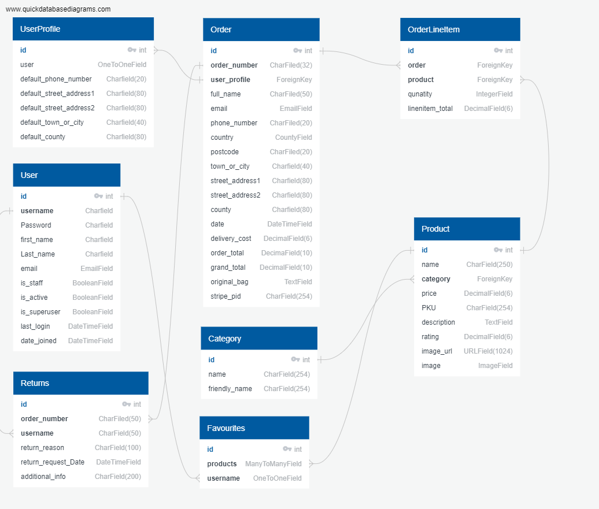
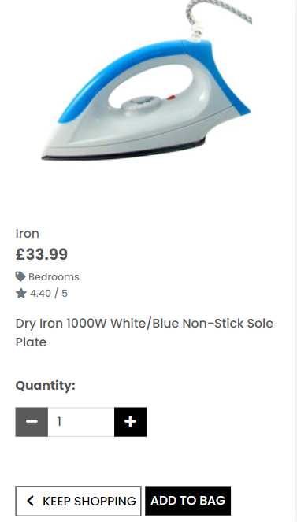
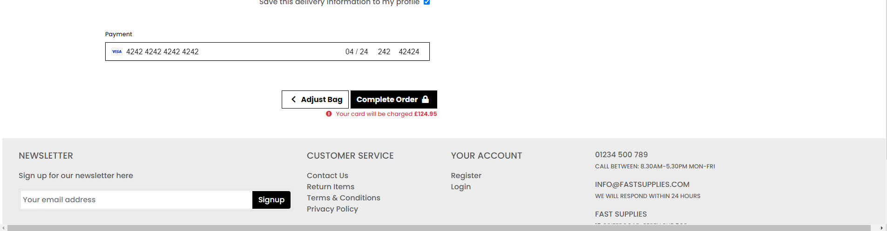
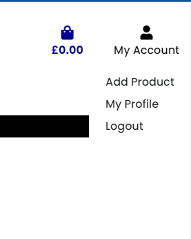

# Fast Supplies Ecommerce website specialized in supplying hotels and catering venues
Fast Supplies allows users to purchase hotel supplies for great prices and super fast deliveries. 
Clients will be able to add items to the bag and make a purchase.   
Client will be able to create a profile to save their profile details and keep track of their previous purchases.  
There are three types of users: guest user, user with profile and superuser.    
Guest user will be able to make a purchase but their profile details won't be saved.  
User will be able to make a purchase and their profile details are saved for future purchases.  
Superuser will be able to add, edit and delete products abd access to back end date to update profiles, groups, categories, orders, etc.
Login for user: username: vamerad password: code@2545

Login for superuser: username: syler password: code2545

For test purchase please use the default stripe test Mastercard number 4242 4242 4242 4242 and any valid expiry date and CVC code. 
<br>

**View the live site [here](https://fast-supplies.herokuapp.com/)**


# Table of Contents
- [Project overview](#project-overview)
- [UX](#ux)
  * [Strategy](#strategy)
    + [Project Goal](#project-goal)
    + [User experience](#user-experience)
      - [Target audience](#target-audience)
      - [User requierements and expectations](#user-requierements-and-expectations)
  * [Structure](#structure)
    + [Website pages](#website-pages)
    + [Code structure](#code-structure)
    + [Database](#database)
    + [Conceptual Database](#conceptual-database)
    + [Physical Database](#physical-database)
  * [Scope](#scope)
    + [User Stories](#user-stories)
    + [User Stories Website Owner](#user-stories-website-owner)
  * [Skeleton](#skeleton)
    + [Wireframes](#wireframes)
  * [Surface](#surface)
    + [Color Palette](#color-palette)
    + [Typography](#typography)
- [Features](#features)
  * [Existing features](#existing-features)
    + [Feature One Navigation and Header](#feature-one-navigation-and-header)
      - [Description feature one](#description-feature-one)
      - [User stories feature one](#user-stories-feature-one)
    + [Feature Two Footer](#feature-two-footer)
      - [Description feature two](#description-feature-two)
      - [User stories feature two](#user-stories-feature-two)
    + [Feature Three Register](#feature-three-register)
      - [Description feature three](#description-feature-three)
      - [User stories feature three](#user-stories-feature-three)
    + [Feature Four Login](#feature-four-login)
      - [Description feature four](#description-feature-four)
      - [User stories feature four](#user-stories-feature-four)
    + [Feature Five Products](#feature-five-products)
      - [Description feature five](#description-feature-five)
      - [User stories feature five](#user-stories-feature-five)
    + [Feature Six Profile](#feature-six-profile)
      - [Description feature six](#description-feature-six)
      - [User stories feature six](#user-stories-feature-six)
    + [Feature Seven Checkout](#feature-seven-checkout)
      - [Description feature seven](#description-feature-seven)
      - [User stories feature seven](#user-stories-feature-seven)
    + [Feature Eight Product Management](#feature-eight-product-management)
      - [Description feature eight](#description-feature-eight)
      - [User stories feature eight](#user-stories-feature-eight)
    + [Feature Nine Admin](#feature-nine-admin)
      - [Description feature nine](#description-feature-nine)
      - [User stories feature nine](#user-stories-feature-nine)
  * [Features left to implement](#features-left-to-implement)
- [Technologies Used](#technologies-used)
  * [Languages](#languages)
  * [Libraries and other resources](#libraries-and-other-resources)
- [Testing](#testing)
- [APIs](#apis)
  * [Email JS](#email-js)
  * [Google Emails](#google-emails)
  * [Stripe](#stripe)
- [Deployment](#deployment)
  * [AWS Amazon Webservices](#aws-amazon-webservices)
  * [Local Deployment](#local-deployment)
- [Bugs](#bugs)
- [Credits](#credits)
- [Content](#content)
- [Media](#media)
- [Acknowledgements](#acknowledgements)


# Project Overview
- Fast Supplies project is an ecoomerce website which specialized in catering equipments and disposables for submission as milestone project 4 as part of the Code Institute - Diploma in Software Development (Full stack) course. 
- The website is deployed using Heroku pages at the following url: [Fast Supplies](http://fast-supplies.herokuapp.com/)
- The repository on GitHub that contains the website source code and assets is available at the following url: [Code Repository](https://github.com/syler11/fast_supplies_ms4)
- The website was built with a responsive look and feel for desktop, tablet and mobile devices

# UX
## Strategy
### Project Goal
The primary goal of the website from the site 
owners perspective is as follows:
- To create/edit/delete products to the websiteavailable to purchase
- To allow users to users to add products to their bags
- To allow users modify their urcahse bag before they would pay
- To allow users to checkout and pay for their bags securely using their debit or credit cards
- To allow users to send messages to the owners
- To create account and save their profile details and previous purchase history

The primary goal of the website from a site users perspective is as follows:
- To allow users to purchase goods
- To allow users modify their bags before checkout
- To allow users to subscrib to newsletters
- To send messages to the owners
- To create profiles / accounts

### User Experience
#### Target audience
- The applications was designed to be used by hopistaliy and catering venues
- Main target audience are managers for responsible for purchases 
- Secodnary target audience are owner / sharholders who could look at various statistics

#### User requierements and expectations
- A simple and intuitive navigation system
- Quickly and easily find relevant information
- Links and functions that work as expected
- Good presentation and a visually appealing design regardless of screen size
- An easy way to find products and them to he bag
- An easy way to adjust the bag content
- An easy way to checkout and pay for the bag content
- Accessibility


## Structure
### Website pages
The website contains 19 pages in a logical structure, information and purpose.
1. Home Page: The first page the user would see when they access the website before they can login to the site.
2. Login: This page allows the user to login to the website. There was no register page added to the landing page to ensure that only authorised personnel could access the website when given access by one of the admin.
3. Register: The first page when user would arrive after successful login. It display all the reservation / navigations and some basic statistics of the exsiting reservations. 
4. Products: This page allows user add new reservation.
5. Products details: This page allows user to edit existing reservation.
6. Add Product: Allows superuser to add new products to the database. 
7. Edit Product: Allows superuser to edit products in the database. 
8. Bag: This page allows user to delete reservation. 
9. Checkout: This contains all the exisitng group profiles in aplhabetical order.
10. Checkout success: This page allows user add new profiles.
11. Order history: This page allows user to edit existing profiles.
12. Logout: This link allows the user to logout of the site.
13. Return: / admin only / This page lists all existing users but visible only for people with admin role. 
14. Privacy policy: This page allows admin users add new users.
15. Terms and Conditions: This page allows admin users to edit existing users. 
16. 404: The 404 error page is displayed if the user enters an incorrect url when accessing the site.
17. 400, 403 and 500: The error page is displayed if the user encounters an error on the site
18. Favourites: This allows logged in users to add products to a customized list on the their favourites page.
19. Returns: This allows logged in users to submit return request for products they have previously purchased.

### Code Structure
The project is divided into a number of apps, as is built using the Django Framework The project was built on the Boutique Ado project, that was part of the project content The apps are described as follows

- bag: This app contains functionality regarding a users shopping bag
- checkout: This app contains functionality regarding a users checking out and payment of an order
- home: This app contains functionality regarding the users home page
- products: This app contains functionality regarding a product. I added functionality for adding/removing a rating/comment to a product
- profiles: This app contains functionality regarding a users profile and order history
- favourites: This app contains funcionality regarding a users favourites products page
- returns: This app contains functionaliy reagrding a uses to submit request form to return purchased items

### Database
- The website is a data-centric one with html, javascript, css used with the materialize framework as a frontend
- The backend consists of Python built with the Django framework with a database of a Postgres for the deployed Heroku version(production)

### Physical Database
This model contains all fields stored in the database collections with their data type and mimics the structure of what is actually stored in the Postgres database.




## Scope

### User Stories

#### User Stories Existing Users  
The user stories for the website user "regular user" (with and without account) are described as follows:
-	User Story 1.1: As a superuser/regular user the navigation bar is displayed with a logo on all pages with a search box, My account, shopping bag icons on a desktop device
- User Story 1.2: As a superuser/regular user the navigation bar is displayed on all pages with a search box, My account, shopping bag icons on smaller screen devices
- User Story 1.3: As a superuser/regular not logged in, I see a Register/Login link under the My Account dropdown
- User Story 1.4: As a superuser/regular logged in/not logged in, I am brought to my shopping bag if I click on the Bag icon
- User Story 1.5: As a superuser/regular user logged in, I see a "My Profile"/Logout under the My Account dropdown
- User Story 1.6: As a superuser/regular user logged in, if I click on the My Profile under My Account I am brought to the My Profile page
- User Story 1.7: As a superuser/regular user logged in, if I click on the My Profile under My Account I am brought to the Logout page. If I click Logout I am Logged out. If I click cancel I am brought back to the homepage
- User Story 1.8: As a superuser/regular user I can view the Home link on smaller screen in the main navigation, and clicking it will bring the user to the homepage
- User Story 1.9: As a superuser/regular user I can click on the "All Products" navigation, click By Price, and will be brought to the Products page, with products price low to high displayed
- User Story 1.10: As a superuser/regular user I can click on the "All Products" navigation, click By Rating, and will be brought to the Products page, with products rating high to low displayed
- User Story 1.11: As a superuser/regular user I can click on the "All Products" navigation, click By Category, and will be brought to the Products page, with products category a-z displayed
- User Story 1.12: As a superuser/regular user I can click on the "Chemicals" navigation, and filter by Rooms & Public area, Restaurant, Kitchen or All Chemicals
- User Story 1.13: As a superuser/regular user I can click on the "Housekeeping" navigation, and filter by Bedrooms, Common areas or All Housekeeping
- User Story 1.14: As a superuser/regular user I can click on the "Tableware" navigation, and filter by Crockery, Cutlery, Glassware or All Tableware
- User Story 1.15: As a superuser/regular user I can click on the "Special Offers" navigation, and filter by New products, Deals, Clearance or All Special Offers
- User Story 1.16: As a superuser/regular user if I encounter an error on the site, I will be navigated to the applicable 400, 403, 404 or 500 error page
-	User Story 2.1: As a superuser/regular user four sections are displayed in the footer are. Newsletter, Customer Service, Your account and General business information
- User Story 2.2: As a superuser/regular user I can sign up for a newsletter by entering my email address and clicking Signup. I will receive an email after signing up
- User Story 2.3: As a superuser/regular user I can contact the website owner by clicking on the contact us navigation and find information usch as returns, terms and conditions and privacy policy
- User Story 2.4: As a superuser/regular user I can login or register at the your account section
- User Story 2.5: As a superuser/regular user I can find usel general business information and I can also see what type of cards are accepted on the website at the bottom of the footer area
-	User Story 3.1: As a superuser/regular user I can register on the website by providing an email address, email address(confirmation), username, password, password confirmation
- User Story 3.2: As a superuser/regular user I will receive an email to verify my account after registering
- User Story 3.3: As a superuser/regular user I can log in to my account once I click on the verification link in the email I receive regarding my registration
- User Story 4.1: As a superuser/regular user I can log in to the website using my username or email address and password. Both fields are mandatory. Once correct, I will be navigated to the homepage and a message displayed
- User Story 4.2: As a superuser/regular user I can request a new password if I forget my current password. I will receive an email to reset my password. Once I reset I can log in
- User Story 5.1: As a superuser/regular user I can view the products page with product count and with each product image, title, category, price
- User Story 5.2: As a superuser/regular user I can sort the products by Price(high to low, low to high), Rating(high to low, low to high), Name(A-Z, Z-A), Category(A-Z, Z-A)
- User Story 5.3: As a superuser/regular user if I click on a product I will be navigated to the product detail page
- User Story 5.4: As a superuser/regular user I can view the product name, price, image, rating, category, description
- User Story 5.5: As a superuser/regular user I can click on the Keep Shopping button on the product detail page, and it will navigate the user to the products page
- User Story 5.6: As a superuser/regular user I can set the quantity for a product
- User Story 6.1: As a superuser/regular user I can view my Default delivery information: Phone Number, Street Address 1, Street Address 2, Town or City, County, State or Locality, Postal Code and Country
- User Story 6.2: As a superuser/regular user I can update my Default delivery information: Phone Number, Street Address 1, Street Address 2, Town or City, County, State or Locality, Postal Code and Country
- User Story 6.3: As a superuser/regular user I can view my order history(Order Number, Date, Items and Order Total)
- User Story 6.4: As a superuser/regular user I can click on an order number to view the order information (Order number, Order date/time, Full Name, Street Address 1, Street Address 2, Town or City, County, State or Locality, Postal Code and Country, Phone Number, Order Total, Deliver, Grand Total)
- User Story 7.1: As a superuser/regular user I can click on a product, set quantity, click Add to Bag and the product will be added to my bag, a message displayed, and a toast will be displayed with the bag contents
- User Story 7.2: As a superuser/regular user I can click on the bag icon, I will be brought to my bag. If there are no items in the bag, a message will be displayed
- User Story 7.3: As a superuser/regular user I can click on the bag icon, I will be brought to my bag. If there are items, the product image, detail, price, quantity, subtotal will be displayed for the item. The bag total, delivery(if applicable), grand total would be displayed
- User Story 7.4: As a superuser/regular user I can update the quantity or remove an item from my shopping bag
- User Story 7.5: As a superuser/regular user I can click on the Secure Checkout button on the bag page or toast message, and I will be brought to the Checkout page
- User Story 7.6: As a superuser/regular user on the checkout page I can set my details(Full Name, email address, both mandatory) and Delivery Information(Phone Number(mandatory), Street Address 1(mandatory), Street Address 2, Town or City(mandatory, County, State or Locality, Postal Code and Country(mandatory), which is populated from my profile if filled in
- User Story 7.7: As a superuser/regular user on the checkout page I can view the order summary(item image, title, quantity, subtotal, order total, delivery, grand total)
- User Story 7.8: As a superuser/regular user on the checkout page if the order total is greater than 100 pounds, there is no delivery charge
- User Story 7.9: As a superuser/regular user on the checkout page if the order total is less than 100 pounds, there is delivery charge(10% of the order total) A message is displayed to the user on the toast message of what they need to add to the bag to avail of no delivery charge
- User Story 7.10: As a superuser/regular user on the checkout page if I click "Save this delivery information to my profile", the details entered will be saved on the users profile
- User Story 7.11: As a superuser/regular user on the checkout page I can enter a credit card number(16 digits), expiry date(2 digits/2digits) and a postal code(up to 5 digits), these fields are mandatory
- User Story 7.12: As a superuser/regular user on the checkout page if I click the Keep Shopping button I will be navigated to the products page
- User Story 7.13: As a superuser/regular user on the checkout page if I click the Complete Order button, and the transaction is not successful, a message will be displayed
- User Story 7.14: As a superuser/regular user on the checkout page if I click the Complete Order button, and the transaction is successful, the user will be navigated to a checkout success page, and an email is sent to the user
- User Story 7.15: As a superuser/regular user on the checkout page if I click the Complete Order button, and the transaction is successful, the order is saved to my order history in My profile page
- User Story 7.16: As a superuser/regular user on the checkout success page, the Order details will be displayed (Order number, Order date/time, Full NameStreet Address 1, Street Address 2, Town or City, County, State or Locality, Postal Code and Country, Phone Number, Order Total, Deliver, Grand Total) and a link to the sales item page is displayed
- User Story 7.17: As a superuser/regular user not logged in, I can add items to my bag and make a purchase
### Added with resubmission*
- User Story 10.1: As a superuser/regular user I can navigate to product details and click on the favourite icon ( empty star) and add product to my own favourites product list
- User Story 10.2: As a superuser/regular user I can navigate to product details and click on the favourite icon (filled star) and remove product from my own favourites product list
- User Story 11.1: As a superuser/regular user I can navigate to the returns page in the my account tab
- User Story 11.2: As a superuser/regular user I can navigate to the returns page in the my account tab and request a return by filling up the form with the mandatory fields
- User Story 11.3: As a superuser/regular user I can receive an email confirming that my return request was succesfully submitted
- User Story 11.4: As a superuser/regular user I can navigate to the returns page in the my account tab and see my previously submitted requests


### User Stories Website Owner
User Stories Website Owner
The user stories for the website owner(superuser) are described as follows: There is a lot of overlap between the two user types, the admin user however has more administrative rights throughout
-	User Story 1.1: As a superuser the navigation bar is displayed with a logo on all pages with a search box, My account, shopping bag icons on a desktop device
- User Story 1.2: As a superuser the navigation bar is displayed on all pages with a search box, My account, shopping bag icons on smaller screen devices
- User Story 1.3: As a not logged in, I see a Register/Login link under the My Account dropdown
- User Story 1.4: As a logged in/not logged in, I am brought to my shopping bag if I click on the Bag icon
- User Story 1.5: As a superuser logged in, I see a "My Profile"/Logout under the My Account dropdown
- User Story 1.6: As a superuser logged in, if I click on the My Profile under My Account I am brought to the My Profile page
- User Story 1.7: As a superuser logged in, if I click on the My Profile under My Account I am brought to the Logout page. If I click Logout I am Logged out. If I click cancel I am brought back to the homepage
- User Story 1.8: As a superuser I can view the Home link on smaller screen in the main navigation, and clicking it will bring the user to the homepage
- User Story 1.9: As a superuser I can click on the "All Products" navigation, click By Price, and will be brought to the Products page, with products price low to high displayed
- User Story 1.10: As a superuser I can click on the "All Products" navigation, click By Rating, and will be brought to the Products page, with products rating high to low displayed
- User Story 1.11: As a superuser I can click on the "All Products" navigation, click By Category, and will be brought to the Products page, with products category a-z displayed
- User Story 1.12: As a superuser I can click on the "Chemicals" navigation, and filter by Rooms & Public area, Restaurant, Kitchen or All Chemicals
- User Story 1.13: As a superuser I can click on the "Housekeeping" navigation, and filter by Bedrooms, Common areas or All Housekeeping
- User Story 1.14: As a superuser I can click on the "Tableware" navigation, and filter by Crockery, Cutlery, Glassware or All Tableware
- User Story 1.15: As a superuser I can click on the "Special Offers" navigation, and filter by New products, Deals, Clearance or All Special Offers
- User Story 1.16: As a superuser if I encounter an error on the site, I will be navigated to the applicable 400, 403, 404 or 500 error page 
-	User Story 2.1: As a superuser four sections are displayed in the footer are. Newsletter, Customer Service, Your account and General business information
- User Story 4.1: As a superuser I can log in to the website using my username or email address and password. Both fields are mandatory. Once correct, I will be navigated to the homepage and a message displayed
- User Story 4.2: As a superuser I can request a new password if I forget my current password. I will receive an email to reset my password. Once I reset I can log in
- User Story 5.7: As a superuser I can view the Add product page by clicking on the My Profile / Add Product link.
- User Story 5.8: As a superuser I can view the Edit product page by clicking on the Edit button on the product.
- User Story 5.9: As a superuser I can click on a product, and I am navigated to the product detail page. I can edit or delete the product by clicking on the Edit or Delete links on the page
- User Story 8.1: As a superuser I can add a product by clicking on the Product Management link in My Account. I must enter a name, category, price, colour, code, description and Image url, upload image and click the Add Product button. Clicking cancel navigates the user to the product page.
- User Story 8.2: As a superuser I can edit a product by clicking on the Edit button on the Products page for the product. I can update thea name, category, price, colour, code, description, and Image url, update an image and click the Edit Product button. Clicking cancel navigates the user to the product page
- User Story 8.3: As a superuser I can delete a product by clicking on the Delete button on the product
- User Story 9.1: As a superuser I can view users orders in the django admin page and can view order number, date, full name, order total, delivery cost, grand total
- User Story 9.2: As a superuser I can view users orders in the django admin page and can search by order number, full name and filter by order number, full name and order date
- User Story 9.3: As a superuser I can view products in the django admin page and can view a products code, name, category, has sizes, price, presale price, rating, image, image url
- User Story 9.4: As a superuser I can view products in the django admin page and can view search and filter by code, category, name and price
- User Story 9.5: As a superuser I can view users in the django admin page and can view their username, email address, first name, last name, staff status
- User Story 9.6: As a superuser I can view users in the django admin page and can search by username and email address and filter by staff status, superuser status and active status
- User Story 9.7: As a superuser I can view categories in the django admin page and can view a category name and friendly name
- User Story 9.8: As a superiser I can view favourites in the django admin page under the favourites tab as per user and the related product SKU
- User Story 9.9: As a superiser I can view return request in the django admin page under the returns tab as per user and the related order number

## Skeleton

### Wireframes
Each wireframe contains three sub images, one for desktop, tablet and mobile

Page | Wireframe | 
------------ | ------------- 
Homepage | [Desktop/Tablet/Mobile](media/wireframes/homepage.png)
Returns | [Desktop/Tablet/Mobile](media/wireframes/returns.png)
Terms and Conditions | [Desktop/Tablet/Mobile](media/wireframes/terms.png)
Privacy Policy | [Desktop/Tablet/Mobile](media/wireframes/privacy_policy.png)
Register | [Desktop/Tablet/Mobile](media/wireframes/register.png)
Login | [Desktop/Tablet/Mobile](media/wireframes/login.png)
Products | [Desktop/Tablet/Mobile](media/wireframes/products.png)
Products Detail | [Desktop/Tablet/Mobile](media/wireframes/product_detail.png)
Bag | [Desktop/Tablet/Mobile](media/wireframes/bag.png)
Checkout | [Desktop/Tablet/Mobile](media/wireframes/checkout.png)
Checkout Success | [Desktop/Tablet/Mobile](media/wireframes/checkout_success.png)
Order History | [Desktop/Tablet/Mobile](media/wireframes/order_history.png)
Add Product | [Desktop/Tablet/Mobile](media/wireframes/add_product.png)
Edit product | [Desktop/Tablet/Mobile](media/wireframes/edit_product.png)
Favourites | [Desktop/Tablet/Mobile](media/wireframes/favourites.png)
Request Return | [Desktop/Tablet/Mobile](media/wireframes/request_returns.png)

## Surface

### Color palette
There are six main colors what I used throughout of this project.
- #555 - The main font colour throughpout the site apart from the main navigation
- #6c757d - Light grey colour for muted text like product categories
- #ececec - footer background colour
- #000 - Banner and some of the buttons back ground colour and navigation font color
- #00008B - Bag colour
- #007bff - Edit icon color
- #dc3545 - Delete icon color

I choose those colours after testing a number of palettes while making sure the colour palette met accessibility standards.


### Typography
The Poppins font is the main font used throughout the whole website with Sans Serif as the fallback font. This font is from the Google fonts library.

# Features

The website have 9 distinct features, and they are described below
What is important to detail is what pages are accessible by the three types of users
1. A  guest user not logged into the site
2. A regular user logged into the site
3. A superuser
The navigation buttons update depending on whether a user is logged in or not, and whether that user is the admin:

 Nav Link              |Guest User  |Regular user with account | Superuser
:-------------         |:------------- |:----------------|:------------- |
Home     |&#10004;        |&#10004;          |&#10004; |
Register               |&#10004;        |&#10004;         |&#10060; |
Log in               |&#10060;        |&#10060;         |&#10060; |
Log out               |&#10060;       |&#10004;          |&#10004; |
Products           |&#10004;        |&#10004;          |&#10004; |
Product Detail           |&#10004;        |&#10004;          |&#10004; |
My Profile             |&#10060;       |&#10004;          |&#10004; |
Bag |&#10004;        |&#10004;          |&#10004; |
Checkout |&#10004;        |&#10004;          |&#10004; |
Checkout success |&#10004;        |&#10004;          |&#10004; |
Order History         |&#10060;       |&#10004;          |&#10004; |
Product Management(Add Product)     |&#10060;       |&#10060;         |&#10004; |
Product Management(Edit Product)     |&#10060;       |&#10060;         |&#10004; |
Product Management(Delete Product)     |&#10060;       |&#10060;         |&#10004; |
Admin backend access |&#10060;        |&#10060;          |&#10004; |
Favourites |&#10060;        |&#10004;          |&#10004; |
Returns |&#10060;        |&#10004;          |&#10004; |


## Existing Features
### Feature One Navigation and Header
#### Description Feature One
- The navigation and header are comprosmising the logo (hidden on small screens) serach bar, shopping bag, my prolfile links and the main navigationlinks (hamburger icon on small screens)
#### Desktop Navigation
  
#### Tablet Navigation
  
#### Mobile Navigation
 

- The look is consistent throughout the website regardless the type of the user
- The my profile page will display differenly for all three type of users
#### My Profile link - Guest user
  
#### My Profile link - Regular user
  
#### My Profile link - Superuser
  

- The main navigation links are comprosmising 5 filters All Products, Chemicals, Housekeeping, Tableware and Special Offers.
  Each links contains additional filter for easier navigation. 
#### Filters - Desktop
  
#### Filters - Tablet
  
#### Filters - Mobile
  
-  I encounter an error on the site, I will be navigated to the applicable 400, 403, 404 or 500 error page
  
 

#### User Stories Feature One
-	User Story 1.1: As a superuser/regular user the navigation bar is displayed with a logo on all pages with a search box, My account, shopping bag icons on a desktop device
- User Story 1.2: As a superuser/regular user the navigation bar is displayed on all pages with a search box, My account, shopping bag icons on smaller screen devices
- User Story 1.3: As a superuser/regular not logged in, I see a Register/Login link under the My Account dropdown
- User Story 1.4: As a superuser/regular logged in/not logged in, I am brought to my shopping bag if I click on the Bag icon
- User Story 1.5: As a superuser/regular user logged in, I see a "My Profile"/Logout under the My Account dropdown
- User Story 1.6: As a superuser/regular user logged in, if I click on the My Profile under My Account I am brought to the My Profile page
- User Story 1.7: As a superuser/regular user logged in, if I click on the My Profile under My Account I am brought to the Logout page. If I click Logout I am Logged out. If I click cancel I am brought back to the homepage
- User Story 1.8: As a superuser/regular user I can view the Home link on smaller screen in the main navigation, and clicking it will bring the user to the homepage
- User Story 1.9: As a superuser/regular user I can click on the "All Products" navigation, click By Price, and will be brought to the Products page, with products price low to high displayed
- User Story 1.10: As a superuser/regular user I can click on the "All Products" navigation, click By Rating, and will be brought to the Products page, with products rating high to low displayed
- User Story 1.11: As a superuser/regular user I can click on the "All Products" navigation, click By Category, and will be brought to the Products page, with products category a-z displayed
- User Story 1.12: As a superuser/regular user I can click on the "Chemicals" navigation, and filter by Rooms & Public area, Restaurant, Kitchen or All Chemicals
- User Story 1.13: As a superuser/regular user I can click on the "Housekeeping" navigation, and filter by Bedrooms, Common areas or All Housekeeping
- User Story 1.14: As a superuser/regular user I can click on the "Tableware" navigation, and filter by Crockery, Cutlery, Glassware or All Tableware
- User Story 1.15: As a superuser/regular user I can click on the "Special Offers" navigation, and filter by New products, Deals, Clearance or All Special Offers
- User Story 1.16: As a superuser/regular user if I encounter an error on the site, I will be navigated to the applicable 400, 403, 404 or 500 error page

### Feature Two Footer
#### Description Feature Two
* The footer area contains 4 distinctive section: Newsletter, Customer Service, Your account and General business information
* It displays a hero image and login facilities.

#### Footer - Desktop

#### Footer - Mobile

#### Newsletter Subscription - Tablet

#### Newsletter Email Confirmation


#### User Stories Feature Two
-	User Story 2.1: As a superuser/regular user four sections are displayed in the footer are. Newsletter, Customer Service, Your account and General business information
- User Story 2.2: As a superuser/regular user I can sign up for a newsletter by entering my email address and clicking Signup. I will receive an email after signing up
- User Story 2.3: As a superuser/regular user I can contact the website owner by clicking on the contact us navigation and find information usch as returns, terms and conditions and privacy policy
- User Story 2.4: As a superuser/regular user I can login or register at the your account section
- User Story 2.5: As a superuser/regular user I can find usel general business information and I can also see what type of cards are accepted on the website at the bottom of the footer area

### Feature Three Register
#### Description Feature Three
- The user cannot register on the website but admin can add users to ensure unauthorized access to sensitive business infromation.
- username is manadtory fields and if they are not entered correctly error message will appear.
- password is manadtory fields and if they are not entered correctly error message will appear.
- After logout the user will be redirected to the login / landing page.

#### Register New Account
 
#### Verify Email
 
#### Verify Email Received
 
#### Email Verification Confirm
 


#### User Stories Feature Three
-	User Story 3.1: As a superuser/regular user I can register on the website by providing an email address, email address(confirmation), username, password, password confirmation
- User Story 3.2: As a superuser/regular user I will receive an email to verify my account after registering
- User Story 3.3: As a superuser/regular user I can log in to my account once I click on the verification link in the email I receive regarding my registration


### Feature Four Login
#### Description Feature Four
- An admin/regular user can log in to the website using their username or email address and password
- Both fields are mandatory
- Once logged in the user will be navigated to the homepage
#### Login Desktop
 
- If the user needs to request a password, they can click on the Forgot Password link
#### Forgot password
 
#### Email password reset
 

#### User Stories Feature Four
- User Story 4.1: As a superuser/regular user I can log in to the website using my username or email address and password. Both fields are mandatory. Once correct, I will be navigated to the homepage and a message displayed
- User Story 4.2: As a superuser/regular user I can request a new password if I forget my current password. I will receive an email to reset my password. Once I reset I can log in

### Feature Five Products
#### Description Feature Five

- The user can view the products page with product count and with each product image, title, category, price
#### Products Desktop

#### Products Tablet

#### Products Mobile


- The user can sort the products by Price(high to low, low to high), Rating(high to low, low to high), Name(A-Z, Z-A), Category(A-Z, Z-A)
- A product detail page displays all the product information (image, description, code, category, description
#### Product Detail Desktop

#### Product Detail Tablet

#### Product Detail Mobile

#### Product View Superuser

#### Edit Product

#### Updated Product


#### User Stories Feature Five
- User Story 5.1: As a superuser/regular user I can view the products page with product count and with each product image, title, category, price
- User Story 5.2: As a superuser/regular user I can sort the products by Price(high to low, low to high), Rating(high to low, low to high), Name(A-Z, Z-A), Category(A-Z, Z-A)
- User Story 5.3: As a superuser/regular user if I click on a product I will be navigated to the product detail page
- User Story 5.4: As a superuser/regular user I can view the product name, price, image, rating, category, description
- User Story 5.5: As a superuser/regular user I can click on the Keep Shopping button on the product detail page, and it will navigate the user to the products page
- User Story 5.6: As a superuser/regular user I can set the quantity for a product
- User Story 5.7: As a superuser I can view the Add product page by clicking on the My Profile / Add Product link.
- User Story 5.8: As a superuser I can view the Edit product page by clicking on the Edit button on the product.
- User Story 5.9: As a superuser I can click on a product, and I am navigated to the product detail page. I can edit or delete the product by clicking on the Edit or Delete links on the page

### Feature Six Profile
#### Description Feature Six
- A regular user or speruser can update their default delivery information as per the user stories below
- A use must be logged in to see their profile page
- This is the information that is displayed when the user is checking out an order
- A user can view and update their Default delivery information

#### My Profile Desktop

#### Order Histrory Tablet

#### Update profile Mobile


#### User Stories Feature Six
- User Story 6.1: As a superuser/regular user I can view my Default delivery information: Phone Number, Street Address 1, Street Address 2, Town or City, County, State or Locality, Postal Code and Country
- User Story 6.2: As a superuser/regular user I can update my Default delivery information: Phone Number, Street Address 1, Street Address 2, Town or City, County, State or Locality, Postal Code and Country
- User Story 6.3: As a superuser/regular user I can view my order history(Order Number, Date, Items and Order Total)
- User Story 6.4: As a superuser/regular user I can click on an order number to view the order information (Order number, Order date/time, Full Name, Street Address 1, Street Address 2, Town or City, County, State or Locality, Postal Code and Country, Phone Number, Order Total, Deliver, Grand Total)

### Feature Seven Checkout
#### Description Feature Seven
- A user can add items to a bag, if the bag is empty a message is displayed

#### Product Quantity before adding to bag

- A user can update the quantity or remove an item from their shopping bag 
#### Product added

- User can fill up the checkout from with name and delivery details and save details for next time if any field is missing or wrong the user will get a notification in red
#### Checkout Form

#### Checkout Form error

- User must fill up the card details to make a purchase if any field is missing or wrong the user will get a notification
#### Stripe Payment form

#### Stripe Payment error

- User will get a confirmation about a succesful purchase what letting the user know the order number and that email was sent to the email give on the form
#### Order Confirmation

- User will receive an email confirmation about the purchase
#### Order Email Confirmation


#### User Stories Feature Seven
- User Story 7.1: As a superuser/regular user I can click on a product, set quantity, click Add to Bag and the product will be added to my bag, a message displayed, and a toast will be displayed with the bag contents
- User Story 7.2: As a superuser/regular user I can click on the bag icon, I will be brought to my bag. If there are no items in the bag, a message will be displayed
- User Story 7.3: As a superuser/regular user I can click on the bag icon, I will be brought to my bag. If there are items, the product image, detail, price, quantity, subtotal will be displayed for the item. The bag total, delivery(if applicable), grand total would be displayed
- User Story 7.4: As a superuser/regular user I can update the quantity or remove an item from my shopping bag
- User Story 7.5: As a superuser/regular user I can click on the Secure Checkout button on the bag page or toast message, and I will be brought to the Checkout page
- User Story 7.6: As a superuser/regular user on the checkout page I can set my details(Full Name, email address, both mandatory) and Delivery Information(Phone Number(mandatory), Street Address 1(mandatory), Street Address 2, Town or City(mandatory, County, State or Locality, Postal Code and Country(mandatory), which is populated from my profile if filled in
- User Story 7.7: As a superuser/regular user on the checkout page I can view the order summary(item image, title, quantity, subtotal, order total, delivery, grand total)
- User Story 7.8: As a superuser/regular user on the checkout page if the order total is greater than 100 pounds, there is no delivery charge
- User Story 7.9: As a superuser/regular user on the checkout page if the order total is less than 100 pounds, there is delivery charge(10% of the order total) A message is displayed to the user on the toast message of what they need to add to the bag to avail of no delivery charge
- User Story 7.10: As a superuser/regular user on the checkout page if I click "Save this delivery information to my profile", the details entered will be saved on the users profile
- User Story 7.11: As a superuser/regular user on the checkout page I can enter a credit card number(16 digits), expiry date(2 digits/2digits) and a postal code(up to 5 digits), these fields are mandatory
- User Story 7.12: As a superuser/regular user on the checkout page if I click the Keep Shopping button I will be navigated to the products page
- User Story 7.13: As a superuser/regular user on the checkout page if I click the Complete Order button, and the transaction is not successful, a message will be displayed
- User Story 7.14: As a superuser/regular user on the checkout page if I click the Complete Order button, and the transaction is successful, the user will be navigated to a checkout success page, and an email is sent to the user
- User Story 7.15: As a superuser/regular user on the checkout page if I click the Complete Order button, and the transaction is successful, the order is saved to my order history in My profile page
- User Story 7.16: As a superuser/regular user on the checkout success page, the Order details will be displayed (Order number, Order date/time, Full NameStreet Address 1, Street Address 2, Town or City, County, State or Locality, Postal Code and Country, Phone Number, Order Total, Deliver, Grand Total) and a link to the sales item page is displayed
- User Story 7.17: As a superuser/regular user not logged in, I can add items to my bag and make a purchase 

### Feature Eight Product Management
#### Description Feature Eight
- Suoeruser can access the add product link via the My profile navigation
- By clicking on add product a new product can be added by filling up the required fields such as Product category, SKU, Name, Description, Quantity, Price, Rating, Image Url and product image. After clicking on the add product button the product will be added and the Superuser will be navigated to the newly added product detail page. Also a message will appear saying the Product was successfully added. 
- By clicking on the blue edit icon the product fields can be updated after overwriting the existing field and clicking on Update product. 
- By clicking on the red delete icon the product can be deleted from the database.

#### Superuser navigation

#### Add product 1

#### Add product 2

#### Product added

#### Update Product

#### Product updated

#### Product deleted


#### User Stories Feature Eight
- User Story 8.1: As a superuser I can add a product by clicking on the Product Management link in My Account. I must enter a name, category, price, colour, code, description and Image url, upload image and click the Add Product button. Clicking cancel navigates the user to the product page.
- User Story 8.2: As a superuser I can edit a product by clicking on the Edit button on the Products page for the product. I can update thea name, category, price, colour, code, description, and Image url, update an image and click the Edit Product button. Clicking cancel navigates the user to the product page
- User Story 8.3: As a superuser I can delete a product by clicking on the Delete button on the product 

### Feature Nine Admin
#### Description Feature Nine
- Superuser can access their own backend via https://fast-supplies.herokuapp.com/admin/ where they can perform CRUD operations of users, products, categories, orders. 

#### Admin Order

#### Admin Products

#### Admin Users

#### Admin Favourites

#### Admin Categories

#### Admin Returns


#### User Stories Feature Nine
- User Story 9.1: As a superuser I can view users orders in the django admin page and can view order number, date, full name, order total, delivery cost, grand total
- User Story 9.2: As a superuser I can view users orders in the django admin page and can search by order number, full name and filter by order number, full name and order date
- User Story 9.3: As a superuser I can view products in the django admin page and can view a products code, name, category, has sizes, price, presale price, rating, image, image url
- User Story 9.4: As a superuser I can view products in the django admin page and can view search and filter by code, category, name and price
- User Story 9.5: As a superuser I can view users in the django admin page and can view their username, email address, first name, last name, staff status
- User Story 9.6: As a superuser I can view users in the django admin page and can search by username and email address and filter by staff status, superuser status and active status
- User Story 9.7: As a superuser I can view categories in the django admin page and can view a category name and friendly name
- User Story 9.8: As a superiser I can view favourites in the django admin page under the favourites tab as per user and the related product SKU
- User Story 9.9: As a superiser I can view return request in the django admin page under the returns tab as per user and the related order number

### Feature Ten Admin
#### Description Feature Ten
- Superuser/regular users can add favourites poduct to their by navigating to the product detail page and click on the empty star icon
- Superuser/regular users can remove favourites poduct to their by navigating to the product detail page and click on the filled star icon

#### Product detail with favourite icon

#### Product added to the favourites list

#### Product removed from the favourites list


#### User Stories Feature Ten
- User Story 10.1: As a superuser/regular user I can navigate to product details and click on the favourite icon ( empty star) and add product to my own favourites product list
- User Story 10.2: As a superuser/regular user I can navigate to product details and click on the favourite icon (filled star) and remove product from my own favourites product list


### Feature Eleven Admin
#### Description Feature Eleven

#### User Stories Feature Eleven
- User Story 11.1: As a superuser/regular user I can navigate to the returns page in the my account tab
- User Story 11.2: As a superuser/regular user I can navigate to the returns page in the my account tab and request a return by filling up the form with the mandatory fields
- User Story 11.3: As a superuser/regular user I can receive an email confirming that my return request was succesfully submitted
- User Story 11.4: As a superuser/regular user I can navigate to the returns page in the my account tab and see my previously submitted requests


## Features left to implement

1. Pagination for products
2. Quick order list for returning customers
3. Add more than one image per product
4. Social share plugin
5. Improved banner / carousel 


# Technologies Used

## Languages

- [Html](https://en.wikipedia.org/wiki/HTML)
- [Css](https://en.wikipedia.org/wiki/CSS)
- [Javascript](https://www.javascript.com/)
- [Python](https://www.python.org/)
- [SQLite3](https://www.sqlite.org/index.html)

## Libraries and other resources

- [JQuery](https://jquery.com/)
- [Bootstrap](https://getbootstrap.com/)
- [Fontawesome](https://fontawesome.com/)
- [Heroku](https://id.heroku.com/)
- [Django framework](https://www.djangoproject.com/)
  + Lot of extensions and libraries as per <code>requirements.txt</code> 
- [Balsamiq](https://balsamiq.com/)
- [Google Font](https://fonts.google.com/)
- [GitHub](https://github.com/)
- [GitPod](https://www.gitpod.io/)
- [Coolors - Color palette generator](https://coolors.co/) 

# Testing
The testing information and results for this project are documented in [TESTING.md](TESTING.md)

# APIs
## Email JS
1. Create an account at emailjs.com 
2. In the integration screen in the emailjs dashboard, note your userid
3. Create an 
 email service in the Email Services section and note the id
4. Create an email template in the Email templates section and note the id
5. Update the script sendEmail.js, method sendMail with your user id, email service id and email template id

## Google emails
To set up the project to send emails and to use a Google account as an SMTP server, the following steps are required
1. Create an email account at google.com, login, navigate to Settings in your gmail account and then click on Other Google Account Settings
2. Turn on 2-step verification and follow the steps to enable
3. Click on app passwords, select Other as the app and give the password a name, for example Django
4. Click create and a 16 digit password will be generated, note the password down
5. In the env.py file, create an environment variable called EMAIL_HOST_PASS with the 16 digit password
6. In the env.py file, create an environment variable called EMAIL_HOST_USER with the email address of the gmail account
7. Set and confirm the following values in the settings.py file to successfully send emails
<br><code>EMAIL_BACKEND = 'django.core.mail.backends.smtp.EmailBackend'</code>
<br><code>EMAIL_USE_TLS = True</code>
<br><code>EMAIL_PORT = 587</code>
<br><code>EMAIL_HOST = 'smtp.gmail.com'</code>
<br><code>EMAIL_HOST_USER = os.environ.get('EMAIL_HOST_USER')</code>
<br><code>EMAIL_HOST_PASSWORD = os.environ.get('EMAIL_HOST_PASS')</code>
<br><code>DEFAULT_FROM_EMAIL = os.environ.get('EMAIL_HOST_USER')</code>
8. You will also need to set the variables EMAIL_HOST_PASS and EMAIL_HOST_USER in your production instance, for example Heroku

## Stripe
1. Register for an account at stripe.com
2. Click on the Developers section of your account once logged in
3. Under Developers, click on the API keys section
4. Note the values for the publishable and secret keys
5. In your local environment(env.py) and heroku, create environment variables STRIPE_PUBLIC_KEY and STRIPE_SECRET_KEY with the publishable and secret key values
<br><code>os.environ('STRIPE_PUBLIC_KEY', 'YOUR_VALUE_GOES_HERE')</code>
<br><code>os.environ('STRIPE_SECRET_KEY', 'YOUR_VALUE_GOES_HERE')</code>
6. Back in the Developers section of your stripe account click on Webhooks
7. Create a webhook with the url of your website <url>/checkout/wh/, for example: https://fast-supplies.herokuapp.com/checkout/wh/
8. Select the payment_intent.payment_failed and payment_intent.succeeded as events to send
9. Note the key created for this webhook
10. In your local environment(env.py) and heroku, create environment variable STRIPE_WH_SECRET with the secret values
<code>os.environ('STRIPE_WH_SECRET', 'YOUR_VALUE_GOES_HERE')</code>

# Deployment
There are several applications that need to be configured to run this application locally or on a cloud based service.


## AWS Amazon Webservices 

To deploy this application to Heroku, run the following steps. ( source CI - boutique-ado tutorial)
1. Create an account at heroku.com
2. Create an app, give it a name for example fast-suuplies, and select a region (EU)
3. Under resources search for postgres, and add a Postgres database to the app
4. Note the DATABASE_URL, this can be set as an environment variable in Heroku and your local deployment(env.py)
5. Install the plugins dj-database-url and psycopg2-binary.
6. Run pip3 freeze > requirements.txt so both are added to the requirements.txt file
7. Create a Procfile with the text: web: gunicorn rugby_shop.wsgi:application for example
8. In the settings.py ensure the connection is to the Heroku postgres database
9. Ensure debug is set to false in the settings.py file
10. Add localhost/127.0.0.1, and fast-supplies.herokuapp.com to the ALLOWED_HOSTS variable in settings.py
11. Run "python3 manage.py showmigrations" to check the status of the migrations
12. Run "python3 manage.py migrate" to migrate the database
13. Run "python3 manage.py createsuperuser" to create a super/admin user
14. Run "python3 manage.py loaddata categories.json" on the categories file in products/fixtures to create the categories
15. Run "python3 manage.py loaddata products.json" on the products file in products/fixtures to create the products
16. Install gunicorn and add it to the requirements.tx file using the command pip3 freeze > requirements.txt
17. From the CLI login to Heroku using the command heroku git:remote -a fast-supplies
18. Disable collectstatic in Heroku before any code is pushed using the command heroku config:set DISABLE_COLLECTSTATIC=1 -a fast-supplies
19. Push the code to Heroku using the command git push heroku master
20. Ensure the following environment variables are set in Heroku
21. Since Heroku disabled GitHub auto deployment use the following step
22. <code>heroku login -i</code> (add email address and password)
23. once logged in use <code>heroku git:remote -a fast-supplies</code>
24. <code>git push heroku main</code>  
22. Click deploy to deploy your application to Heroku for the first time
23. Click on the link provided to access the application
24. If you encounter any issues accessing the build logs is a good way to troubleshoot the issue

## Local Deployment
To run this project locally, you will need to clone the repository
1. Login to GitHub (https://wwww.github.com)
2. Select the repository syler/MS3-ProGroup-App
3. Click the Code button and copy the HTTPS url, for example: https://github.com/syler11/fast_supplies_ms4.git
4. In your IDE, open a terminal and run the git clone command, for example 

    ```git clone https://github.com/syler11/fast_supplies_ms4.git```

5. The repository will now be cloned in your workspace
6. Create an env.py file in the root folder in your project, and add in the following code with the relevant key, value pairs, and ensure you enter the correct key values<br>
<code>import os</code><br>
<code>os.environ["SECRET_KEY"] = "TO BE ADDED BY USER"</code><br>
<code>os.environ["AWS_ACCESS_KEY_ID"] = "TO BE ADDED BY USER"</code><br>
<code>os.environ["AWS_SECRET_ACCESS_KEY"] = "TO BE ADDED BY USER"</code><br>
<code>os.environ["STRIPE_PUBLIC_KEY"] = "TO BE ADDED BY USER"</code><br>
<code>os.environ["STRIPE_SECRET_KET"] = "TO BE ADDED BY USER"</code><br>
<code>os.environ["STRIPE_WH_SECRET"] = "TO BE ADDED BY USER"</code><br>
7. Install the relevant packages as per the requirements.txt file
8. In the settings.py ensure the connection is set to either the Heroku postgres database or the local sqllite database
9. Ensure debug is set to true in the settings.py file for local development
10. Add localhost/127.0.0.1 to the ALLOWED_HOSTS variable in settings.py
11. Run "python3 manage.py showmigrations" to check the status of the migrations
12. Run "python3 manage.py migrate" to migrate the database
13. Run "python3 manage.py createsuperuser" to create a super/admin user
14. Run "python3 manage.py loaddata categories.json" on the categories file in products/fixtures to create the categories
15. Run "python3 manage.py loaddata products.json" on the products file in products/fixtures to create the products
16. Run "python3 manage.py loaddata news.json" on the news file in news/fixtures to create the news items(optional)
17. Start the application by running <code>python3 manage.py runserver</code>
18. Open the application in a web browser, for example: http://127.0.0.1:8000/

# Bugs

Bugs:

1. Heroku securtiy breach made heroku deployment a lot more challenging
2. Newsletters function didn't work as js was in the bottom of the page, once it was moved header it worked again
3. Email wasn't going out after heroku deployment had to set up propery the environ parameters
4. Example.com was going out in the emails


# Credits

Credit to https://codeinstitute.net/ for the lesson on email.js  
Credit to https://favicon.io/favicon-converter/ for the Favicon    
Credit to https://app.quickdatabasediagrams.com/ for the Database Model   
Credit to https://websitemockupgenerator.com/ for the Website mockup picture    
Credit to https://fontawesome.com/ for the Icona displayed on the website    
Credit to https://validator.w3.org/ for the html and css validation  
Credit to https://wave.webaim.org/ for accessibility check for the website  
Credit to https://www.emailjs.com/ for email sending functionality for the website   
Credit to https://www.google.com/ for the Lighthouse report  
Credit to https://stackoverflow.com/ for being a valuabe source for various functions  
Credit to Paul Meeneghan whose project's readme and testing files inspisred me a more extensive documentation


# Content

- Font Awesome (http://fontawesome.com)    
    - The icons used on the site from font awesome

# Media

Photos:

1. product pcitures from Alliance National
2. Logo designed by my wife Nikolett who has just started learning webdesign
3. website-mockup.png from https://websitemockupgenerator.com/

# Acknowledgment

- I would like to thank my wife who is also my co-worker who helped me to test the functionalities and gave me ideas how to include certain features. 
- I would like to thank my mentor Mo Shami for the guidance and support.
