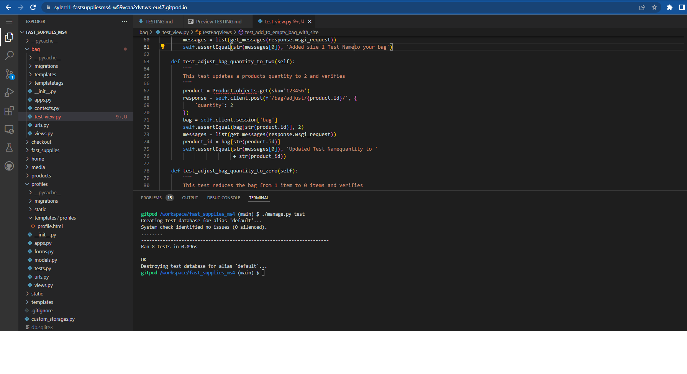

# Table of Contents
- [Testing](#testing)
  * [Unit Testing](#unit-testing)
    + [Unit Testing for the Bag app](#unit-testing-for-the-bag-app)
  * [Manual Testing](#manual-testing)
  * [Feature One Navigation and Header](#feature-one-navigation-and-header)
    + [User Story Feature 1](#user-story-feature-1)
    + [User Story Steps 1](#user-story-steps-1)
    + [User Story Testing Results 1](#user-story-testing-results-1)
  * [Feature Two Footer](#feature-two-footer)
    + [User Story Feature 2](#user-story-feature-2)
    + [User Story Steps 2](#user-story-steps-2)
    + [User Story Testing Results 2](#user-story-testing-results-2)
  * [Feature Three Register](#feature-three-register)
    + [User Story Feature 3](#user-story-feature-3)
    + [User Story Steps 3](#user-story-steps-3)
    + [User Story Testing Results 3](#user-story-testing-results-3)
  * [Feature Four Login](#feature-four-login)
    + [User Story Feature 4](#user-story-feature-4)
    + [User Story Steps 4](#user-story-steps-4)
    + [User Story Testing Results 4](#user-story-testing-results-4)
  * [Feature Five Products](#feature-five-products)
    + [User Story Feature 5](#user-story-feature-5)
    + [User Story Steps 5](#user-story-steps-5)
    + [User Story Testing Results 5](#user-story-testing-results-5)
  * [Feature Six Profile](#feature-six-profile)
    + [User Story Feature 6](#user-story-feature-6)
    + [User Story Steps 6](#user-story-steps-6)
    + [User Story Testing Results 6](#user-story-testing-results-6)
  * [Feature Seven Checkout](#feature-seven-checkout)
    + [User Story Feature 7](#user-story-feature-7)
    + [User Story Steps 7](#user-story-steps-7)
    + [User Story Testing Results 7](#user-story-testing-results-7)
  * [Feature Eight Product Management](#feature-eight-product-management)
    + [User Story Feature 8](#user-story-feature-8)
    + [User Story Steps 8](#user-story-steps-8)
    + [User Story Testing Results 8](#user-story-testing-results-8)
  * [Feature Nine Django Admin](#feature-nine-django-admin)
    + [User Story Feature 9](#user-story-feature-9)
    + [User Story Steps 9](#user-story-steps-9)
    + [User Story Testing Results 9](#user-story-testing-results-9)
  * [Feature Ten Favourites](#feature-ten-favourites)
    + [User Story Feature 10](#user-story-feature-10)
    + [User Story Steps 10](#user-story-steps-10)
    + [User Story Testing Results 10](#user-story-testing-results-10)
  * [Feature Eleven Returns](#feature-eleven-returns)
    + [User Story Feature 11](#user-story-feature-11)
    + [User Story Steps 11](#user-story-steps-11)
    + [User Story Testing Results 11](#user-story-testing-results-11)
- [Code Validators and Website Analysis](#code-validators-and-website-analysis)
  * [HTML Markup Validation Service](#html-markup-validation-service)
  * [CSS Validation Service](#css-validation-service)
  * [Chrome Dev tools Lighthouse](#chrome-dev-tools-lighthouse)
    + [Desktop](#desktop)
    + [Mobile](#mobile)
  * [Wave Accessibility](#wave-accessibility)
  * [JSHint](#jshint)
  * [PEP8online](#pep8online)

# Testing

## Unit Testing
- Due the approaching deadline for the assessment I have only done one testing for the bag.
- The number of unit tests are 8 and I used the Django testing framework for it.
- To run the test type at the command line <code>./manage.py test</code>

### Unit Testing for the Bag app
- Bag app doesn't have the models or forms therefore only the view was tested.
- The test was covering 8 tests adding, removing,changing items in the bag. 
- The test run without errors or failures as per the screenshot below. 

## Manual Testing
Testing was completed on the following browsers and device types

Device Number | Physical/Emulator | Device Name | Device Type | Browser | Version
------------ | ------------ | ------------- | ------------- | ------------- | -------------
1 | Physical | iPad 9th Gen | Tablet |  Safari | 15.4.1 |
2 | Physical | iPhone 11 | Mobile |Safari | 15.4.1 |
3 | Physical | MacBook Pro | Laptop | Safari | 14.1 |
4 | Physical | Windows Desktop| Desktop | Microsoft Edge | 101.0 |
5 | Physical | Windows Desktop| Desktop | Chrome | 101.0 |
6 | Emulator | iPhone 5/SE | Mobile | Chrome Emulator | 101.0 |
7 | Emulator | iPhone X | Mobile | Chrome Emulator | 101.0 |
8 | Emulator | iPad | Tablet | Chrome Emulator | 101.0 |

## Feature One Navigation and Header

### User Story Feature 1   
-	User Story 1.1: As a superuser/regular user the navigation bar is displayed with a logo on all pages with a search box, My account, shopping bag icons on a desktop device
- User Story 1.2: As a superuser/regular user the navigation bar is displayed on all pages with a search box, My account, shopping bag icons on smaller screen devices
- User Story 1.3: As a superuser/regular not logged in, I see a Register/Login link under the My Account dropdown
- User Story 1.4: As a superuser/regular logged in/not logged in, I am brought to my shopping bag if I click on the Bag icon
- User Story 1.5: As a superuser/regular user logged in, I see a "My Profile"/Logout under the My Account dropdown
- User Story 1.6: As a superuser/regular user logged in, if I click on the My Profile under My Account I am brought to the My Profile page
- User Story 1.7: As a superuser/regular user logged in, if I click on the My Profile under My Account I am brought to the Logout page. If I click Logout I am Logged out. If I click cancel I am brought back to the homepage
- User Story 1.8: As a superuser/regular user I can view the Home link on smaller screen in the main navigation, and clicking it will bring the user to the homepage
- User Story 1.9: As a superuser/regular user I can click on the "All Products" navigation, click By Price, and will be brought to the Products page, with products price low to high displayed
- User Story 1.10: As a superuser/regular user I can click on the "All Products" navigation, click By Rating, and will be brought to the Products page, with products rating high to low displayed
- User Story 1.11: As a superuser/regular user I can click on the "All Products" navigation, click By Category, and will be brought to the Products page, with products category a-z displayed
- User Story 1.12: As a superuser/regular user I can click on the "Chemicals" navigation, and filter by Rooms & Public area, Restaurant, Kitchen or All Chemicals
- User Story 1.13: As a superuser/regular user I can click on the "Housekeeping" navigation, and filter by Bedrooms, Common areas or All Housekeeping
- User Story 1.14: As a superuser/regular user I can click on the "Tableware" navigation, and filter by Crockery, Cutlery, Glassware or All Tableware
- User Story 1.15: As a superuser/regular user I can click on the "Special Offers" navigation, and filter by New products, Deals, Clearance or All Special Offers
- User Story 1.16: As a superuser/regular user if I encounter an error on the site, I will be navigated to the applicable 400, 403, 404 or 500 error page
### User Story Steps 1
1. Navigate to https://fast-supplies.herokuapp.com/ and click on the My Account link as a regular user
2. Login as regular user, logo is displayed on desktop size and hamburger icon on smaller sizes, click on the My Account button  
3. Navigate to the "All Products" filter, and then click By Price
4. Navigate to the "All Products" filter, and then click By Rating
5. Navigate to the "All Products" filter, and then click By Category
6. Navigate to the "Chemicals" filter, and filter by Kitchen
7. Navigate to the "Housekeeping" filter, and filter by Bedrooms
8. Navigate to the "Tableware" filter, and filter by Glassware
9. Navigate to https://fast-supplies.herokuapp.com/brokenlink 
10. Click the Logout link under My profile and logout
11. Login as a superuser and click on the My account link

### User Story Testing Results 1    
Step| Result | Desktop | Tablet | Mobile | Status
------------ | ------------ | ------------- | ------------- | ------------- | -------------
Step 1 | The homepage is displayed, Main Navigation and Login and Register links are displayed  under My Account are displayed with website links(Register/Login) | [Desktop](media/testing/user_stories/user_story_result_one/user_story1_step_1_desktop.png)  | [Tablet](media/testing/user_stories/user_story_result_one/user_story1_step_1_tablet.png)  | [Mobile](media/testing/user_stories/user_story_result_one/user_story1_step_1_mobile.png)  | Passed | 
Step 2 | The homepage is displayed, Main Navigation and Login and Register links are displayed  under My Account are displayed with website links(My Profile/Logout) | [Desktop](media/testing/user_stories/user_story_result_one/user_story1_step_2_desktop.png)  | [Tablet](media/testing/user_stories/user_story_result_one/user_story1_step_2_tablet.png)  | [Mobile](media/testing/user_stories/user_story_result_one/user_story1_step_2_mobile.png)  | Passed | 
Step 3 | Products on the page are filtered by Price (Low-High) | [Desktop](media/testing/user_stories/user_story_result_one/user_story1_step_3_desktop.png)  | [Tablet](media/testing/user_stories/user_story_result_one/user_story1_step_3_tablet.png)  | [Mobile](media/testing/user_stories/user_story_result_one/user_story1_step_3_mobile.png)  | Passed | 
Step 4 | Products on the page are filtered by Rating (High-Low) | [Desktop](media/testing/user_stories/user_story_result_one/user_story1_step_4_desktop.png)  | [Tablet](media/testing/user_stories/user_story_result_one/user_story1_step_4_tablet.png)  | [Mobile](media/testing/user_stories/user_story_result_one/user_story1_step_4_mobile.png)  | Passed | 
Step 5 | Products on the page are filtered by Category (A-Z) | [Desktop](media/testing/user_stories/user_story_result_one/user_story1_step_5_desktop.png)  | [Tablet](media/testing/user_stories/user_story_result_one/user_story1_step_5_tablet.png)  | [Mobile](media/testing/user_stories/user_story_result_one/user_story1_step_5_mobile.png)  | Passed | 
Step 6 | Products on the page are filtered by Kitchen "Chemicals" | [Desktop](media/testing/user_stories/user_story_result_one/user_story1_step_6_desktop.png)  | [Tablet](media/testing/user_stories/user_story_result_one/user_story1_step_6_tablet.png)  | [Mobile](media/testing/user_stories/user_story_result_one/user_story1_step_6_mobile.png)  | Passed | 
Step 7 | Products on the page are filtered by Bedroms "Housekeeping" | [Desktop](media/testing/user_stories/user_story_result_one/user_story1_step_7_desktop.png)  | [Tablet](media/testing/user_stories/user_story_result_one/user_story1_step_7_tablet.png)  | [Mobile](media/testing/user_stories/user_story_result_one/user_story1_step_7_mobile.png)  | Passed | 
Step 8 | Products on the page are filtered by Glassware "Tableware" | [Desktop](media/testing/user_stories/user_story_result_one/user_story1_step_8_desktop.png)  | [Tablet](media/testing/user_stories/user_story_result_one/user_story1_step_8_tablet.png)  | [Mobile](media/testing/user_stories/user_story_result_one/user_story1_step_8_mobile.png)  | Passed | 
Step 9 | A 404 page is displayed with link to home button | [Desktop](media/testing/user_stories/user_story_result_one/user_story1_step_9_desktop.png)  | [Tablet](media/testing/user_stories/user_story_result_one/user_story1_step_9_tablet.png)  | [Mobile](media/testing/user_stories/user_story_result_one/user_story1_step_9_mobile.png)  | Passed | 
Step 10 | The user is logged out | [Desktop](media/testing/user_stories/user_story_result_one/user_story1_step_10_desktop.png)  | [Tablet](media/testing/user_stories/user_story_result_one/user_story1_step_10_tablet.png)  | [Mobile](media/testing/user_stories/user_story_result_one/user_story1_step_10_mobile.png)  | Passed | 
Step 11 | The homepage is displayed, Main Navigation and Login and Register links are displayed  under My Account are displayed with website links(Add Product/My Profile/Logout) | [Desktop](media/testing/user_stories/user_story_result_one/user_story1_step_11_desktop.png)  | [Tablet](media/testing/user_stories/user_story_result_one/user_story1_step_11_tablet.png)  | [Mobile](media/testing/user_stories/user_story_result_one/user_story1_step_11_mobile.png)  | Passed | 

## Feature Two Footer

### User Story Feature 2  
-	User Story 2.1: As a superuser/regular user four sections are displayed in the footer are. Newsletter, Customer Service, Your account and General business information
- User Story 2.2: As a superuser/regular user I can sign up for a newsletter by entering my email address and clicking Signup. I will receive an email after signing up
- User Story 2.3: As a superuser/regular user I can contact the website owner by clicking on the contact us navigation and find information usch as returns, terms and conditions and privacy policy
- User Story 2.4: As a superuser/regular user I can login or register at the your account section
- User Story 2.5: As a superuser/regular user I can find usel general business information and I can also see what type of cards are accepted on the website at the bottom of the footer area

### User Story Steps 2
- Regular user / Superuser scroll down to the bottom of the page to acces navigation, newsletter and general information
- Regular user / Superuser sign up for newsletter 
- Regular user / Superuser click on the Returns / Terms and Conditions or Privcay Policy 

### User Story Testing Results 2
Step| Result | Desktop | Tablet | Mobile | Status
------------ | ------------ | ------------- | ------------- | ------------- | -------------
Step 1 | The footer features the Newsletter, Customer servcie, Your account and General information | [Desktop](media/testing/user_stories/user_story_result_two/user_story2_step_1_desktop.png)  | [Tablet](media/testing/user_stories/user_story_result_two/user_story2_step_1_tablet.png)  | [Mobile](media/testing/user_stories/user_story_result_two/user_story2_step_1_mobile.png)  | Passed | 
Step 2 | User receives an instant notification that the subscription was successful and email will be received | [Desktop](media/testing/user_stories/user_story_result_two/user_story2_step_2_desktop.png)  | [Tablet](media/testing/user_stories/user_story_result_two/user_story2_step_2_tablet.png)  | [Mobile](media/testing/user_stories/user_story_result_two/user_story2_step_2_mobile.png)  | Passed | 
Step 3 | User can access Returns, Terms and Conditions and Privacy policy page on all screen sizes | [Desktop](media/testing/user_stories/user_story_result_two/user_story2_step_3_desktop.png)  | [Tablet](media/testing/user_stories/user_story_result_two/user_story2_step_3_tablet.png)  | [Mobile](media/testing/user_stories/user_story_result_two/user_story2_step_3_mobile.png)  | Passed | 

## Feature Three Register

### User Story Feature 3
-	User Story 3.1: As a superuser/regular user I can register on the website by providing an email address, email address(confirmation), username, password, password confirmation
- User Story 3.2: As a superuser/regular user I will receive an email to verify my account after registering
- User Story 3.3: As a superuser/regular user I can log in to my account once I click on the verification link in the email I receive regarding my registration

### User Story Steps 3
1. As a regular user, navigate to the registration page, fill in email address, repeat email address, username, password, repeat password and click Register
2. Open and click on the verification link in the email received
3. Confirm the email address for the account
4. Log in to the account using the same email and password combination
5. User now logged in as a regular user
 
### User Story Testing Results 3    
Step| Result | Desktop | Tablet | Mobile | Status
------------ | ------------ | ------------- | ------------- | ------------- | -------------
Step 1 | The user register for a new account | [Desktop](media/testing/user_stories/user_story_result_three/user_story3_step_1_desktop.png)  | [Tablet](media/testing/user_stories/user_story_result_three/user_story3_step_1_tablet.png)  | [Mobile](media/testing/user_stories/user_story_result_three/user_story3_step_1_mobile.png)  | Passed | 
Step 2 | The user receives an email and click on the email verification link | [Desktop](media/testing/user_stories/user_story_result_three/user_story3_step_2_desktop.png)  | N/A  | N/A  | Passed | 
Step 3 | The user confirms the email address | [Desktop](media/testing/user_stories/user_story_result_three/user_story3_step_3_desktop.png)  | [Tablet](media/testing/user_stories/user_story_result_three/user_story3_step_3_tablet.png)  | [Mobile](media/testing/user_stories/user_story_result_three/user_story3_step_3_mobile.png)  | Passed | 
Step 4 | User now can log in | [Desktop](media/testing/user_stories/user_story_result_three/user_story3_step_4_desktop.png)  | [Tablet](media/testing/user_stories/user_story_result_three/user_story3_step_4_tablet.png)  | [Mobile](media/testing/user_stories/user_story_result_three/user_story3_step_4_mobile.png)  | Passed | 
Step 5 | User now can logged in | [Desktop](media/testing/user_stories/user_story_result_one/user_story1_step_2_desktop.png)  | [Tablet](media/testing/user_stories/user_story_result_one/user_story1_step_2_tablet.png)  | [Mobile](media/testing/user_stories/user_story_result_one/user_story1_step_2_mobile.png)  | Passed | 

## Feature Four Login

### User Story Feature 4   
- User Story 4.1: As a superuser/regular user I can log in to the website using my username or email address and password. Both fields are mandatory. Once correct, I will be navigated to the homepage (if the username / password combination is incorrect a message will be displayed)
- User Story 4.2: As a superuser/regular user I can request a new password if I forget my current password. I will receive an email to reset my password. Once I reset I can log in

### User Story Steps 4
1. Use an incorrect combination if the username and password
2. Request a forgot password
3. Log in with the new password

### User Story Testing Results 4    
Step| Result | Desktop | Tablet | Mobile | Status
------------ | ------------ | ------------- | ------------- | ------------- | -------------
Step 1 | Error message displayed | [Desktop](media/testing/user_stories/user_story_result_four/user_story4_step_1_desktop.png)  | [Tablet](media/testing/user_stories/user_story_result_four/user_story4_step_1_tablet.png)  | [Mobile](media/testing/user_stories/user_story_result_four/user_story4_step_1_mobile.png)  | Passed | 
Step 2 | User received password reset email | [Desktop](media/testing/user_stories/user_story_result_four/user_story4_step_2_desktop.png)  | N/A  | N/A  | Passed | 
Step 3 | User ssuccesfully changed the password abd now can log in | [Desktop](media/testing/user_stories/user_story_result_four/user_story4_step_3_desktop.png)  | [Tablet](media/testing/user_stories/user_story_result_four/user_story4_step_3_tablet.png)  | [Mobile](media/testing/user_stories/user_story_result_four/user_story4_step_3_mobile.png)  | Passed | 

## Feature Five Products

### User Story Feature 5
- User Story 5.1: As a superuser/regular user I can view the products page with product count and with each product image, title, category, price
- User Story 5.2: As a superuser/regular user I can sort the products by Price(high to low, low to high), Rating(high to low, low to high), Name(A-Z, Z-A), Category(A-Z, Z-A)
- User Story 5.3: As a superuser/regular user if I click on a product I will be navigated to the product detail page
- User Story 5.4: As a superuser/regular user I can view the product name, price, image, rating, category, description
- User Story 5.5: As a superuser/regular user I can click on the Keep Shopping button on the product detail page, and it will navigate the user to the products page
- User Story 5.6: As a superuser/regular user I can set the quantity for a product
- User Story 5.7: As a superuser I can view the Add product page by clicking on the My Profile / Add Product link.
- User Story 5.8: As a superuser I can view the Edit product page by clicking on the Edit button on the product.
- User Story 5.9: As a superuser I can click on a product, and I am navigated to the product detail page. I can edit or delete the product by clicking on the Edit or Delete links on the page

### User Story Steps 5
1. As a regular user login to the website and navigate to the products page
2. Sort the products from Price(High to Low)
3. Click on a product
4. Add a product(kettle) to the bag, with a quantity of 3
5. As an superuser login and click on the Add Product(My Account)
6. As a superuser click on the edit or delete button on the products page or in the product detail page and edit or delete the product

### User Story Testing Results 5
Step| Result | Desktop | Tablet | Mobile | Status
------------ | ------------ | ------------- | ------------- | ------------- | -------------
Step 1 | All products are displayed | [Desktop](media/testing/user_stories/user_story_result_five/user_story5_step_1_desktop.png)  | [Tablet](media/testing/user_stories/user_story_result_five/user_story5_step_1_tablet.png)  | [Mobile](media/testing/user_stories/user_story_result_five/user_story5_step_1_mobile.png)  | Passed | 
Step 2 | All products displayed by price from High to Low | [Desktop](media/testing/user_stories/user_story_result_five/user_story5_step_2_desktop.png)  | [Tablet](media/testing/user_stories/user_story_result_five/user_story5_step_2_tablet.png)  | [Mobile](media/testing/user_stories/user_story_result_five/user_story5_step_2_mobile.png)  | Passed | 
Step 3 | Selected product detail is displayed | [Desktop](media/testing/user_stories/user_story_result_five/user_story5_step_3_desktop.png)  | [Tablet](media/testing/user_stories/user_story_result_five/user_story5_step_3_tablet.png)  | [Mobile](media/testing/user_stories/user_story_result_five/user_story5_step_3_mobile.png)  | Passed | 
Step 4 | 3 kettles added to the bag | [Desktop](media/testing/user_stories/user_story_result_five/user_story5_step_4_desktop.png)  | [Tablet](media/testing/user_stories/user_story_result_five/user_story5_step_4_tablet.png)  | [Mobile](media/testing/user_stories/user_story_result_five/user_story5_step_4_mobile.png)  | Passed | 
Step 5 | Add product is displayed for superuser | [Desktop](media/testing/user_stories/user_story_result_five/user_story5_step_5_desktop.png)  | [Tablet](media/testing/user_stories/user_story_result_five/user_story5_step_5_tablet.png)  | [Mobile](media/testing/user_stories/user_story_result_five/user_story5_step_5_mobile.png)  | Passed | 
Step 6 | Edit and delete button are displayed for superuser | [Desktop](media/testing/user_stories/user_story_result_five/user_story5_step_6_desktop.png)  | [Tablet](media/testing/user_stories/user_story_result_five/user_story5_step_6_tablet.png)  | [Mobile](media/testing/user_stories/user_story_result_five/user_story5_step_6_mobile.png)  | Passed | 

## Feature Six Profile

### User Story Feature 6
- User Story 6.1: As a superuser/regular user I can view my Default delivery information: Phone Number, Street Address 1, Street Address 2, Town or City, County, State or Locality, Postal Code and Country
- User Story 6.2: As a superuser/regular user I can update my Default delivery information: Phone Number, Street Address 1, Street Address 2, Town or City, County, State or Locality, Postal Code and Country
- User Story 6.3: As a superuser/regular user I can view my order history(Order Number, Date, Items and Order Total)
- User Story 6.4: As a superuser/regular user I can click on an order number to view the order information (Order number, Order date/time, Full Name, Street Address 1, Street Address 2, Town or City, County, State or Locality, Postal Code and Country, Phone Number, Order Total, Deliver, Grand Total)

### User Story Steps 6
1. Click on the My Profile link under My Account
2. Update one field in the default delivery information (Street Address 1 to 2 Main Street)
3. Click on an order number

### User Story Testing Results 6
Step| Result | Desktop | Tablet | Mobile | Status
------------ | ------------ | ------------- | ------------- | ------------- | -------------
Step 1 | The delivery information and the order history displayed | [Desktop](media/testing/user_stories/user_story_result_six/user_story6_step_1_desktop.png)  | [Tablet](media/testing/user_stories/user_story_result_six/user_story6_step_1_tablet.png)  | [Mobile](media/testing/user_stories/user_story_result_six/user_story6_step_1_mobile.png)  | Passed | 
Step 2 | Street Address 1 was updated to 2 Main Street successfully | [Desktop](media/testing/user_stories/user_story_result_six/user_story6_step_2_desktop.png)  | [Tablet](media/testing/user_stories/user_story_result_six/user_story6_step_2_tablet.png)  | [Mobile](media/testing/user_stories/user_story_result_six/user_story6_step_2_mobile.png)  | Passed | 
Step 3 | Selected past order details displayed | [Desktop](media/testing/user_stories/user_story_result_six/user_story6_step_3_desktop.png)  | [Tablet](media/testing/user_stories/user_story_result_six/user_story6_step_3_tablet.png)  | [Mobile](media/testing/user_stories/user_story_result_six/user_story6_step_3_mobile.png)  | Passed | 

## Feature Seven Checkout

### User Story Feature 7
- User Story 7.1: As a superuser/regular user I can click on a product, set quantity, click Add to Bag and the product will be added to my bag, a message displayed, and a toast will be displayed with the bag contents
- User Story 7.2: As a superuser/regular user I can click on the bag icon, I will be brought to my bag. If there are no items in the bag, a message will be displayed
- User Story 7.3: As a superuser/regular user I can click on the bag icon, I will be brought to my bag. If there are items, the product image, detail, price, quantity, subtotal will be displayed for the item. The bag total, delivery(if applicable), grand total would be displayed
- User Story 7.4: As a superuser/regular user I can update the quantity or remove an item from my shopping bag
- User Story 7.5: As a superuser/regular user I can click on the Secure Checkout button on the bag page or toast message, and I will be brought to the Checkout page
- User Story 7.6: As a superuser/regular user on the checkout page I can set my details(Full Name, email address, both mandatory) and Delivery Information(Phone Number(mandatory), Street Address 1(mandatory), Street Address 2, Town or City(mandatory, County, State or Locality, Postal Code and Country(mandatory), which is populated from my profile if filled in
- User Story 7.7: As a superuser/regular user on the checkout page I can view the order summary(item image, title, quantity, subtotal, order total, delivery, grand total)
- User Story 7.8: As a superuser/regular user on the checkout page if the order total is greater than 100 pounds, there is no delivery charge
- User Story 7.9: As a superuser/regular user on the checkout page if the order total is less than 100 pounds, there is delivery charge(10% of the order total) A message is displayed to the user on the toast message of what they need to add to the bag to avail of no delivery charge
- User Story 7.10: As a superuser/regular user on the checkout page if I click "Save this delivery information to my profile", the details entered will be saved on the users profile
- User Story 7.11: As a superuser/regular user on the checkout page I can enter a credit card number(16 digits), expiry date(2 digits/2digits) and a postal code(up to 5 digits), these fields are mandatory
- User Story 7.12: As a superuser/regular user on the checkout page if I click the Keep Shopping button I will be navigated to the products page
- User Story 7.13: As a superuser/regular user on the checkout page if I click the Complete Order button, and the transaction is not successful, a message will be displayed
- User Story 7.14: As a superuser/regular user on the checkout page if I click the Complete Order button, and the transaction is successful, the user will be navigated to a checkout success page, and an email is sent to the user
- User Story 7.15: As a superuser/regular user on the checkout page if I click the Complete Order button, and the transaction is successful, the order is saved to my order history in My profile page
- User Story 7.16: As a superuser/regular user on the checkout success page, the Order details will be displayed (Order number, Order date/time, Full NameStreet Address 1, Street Address 2, Town or City, County, State or Locality, Postal Code and Country, Phone Number, Order Total, Deliver, Grand Total) and a link to the sales item page is displayed
- User Story 7.17: As a superuser/regular user not logged in, I can add items to my bag and make a purchase 

### User Story Steps 7
1. As a regular user add some items to your bag, so the order is less than £100 pounds
2. Empty the bag
3. Add the items back into the bag, so the order more than £100 pounds
4. Fill out all the mandatory fields and also the bank card details to checkout the order 
5. The checkout success opage is displayed 
5. Check the users email address
6. Go to the order details on the users my profile page

### User Story Testing Results 7
Step| Result | Desktop | Tablet | Mobile | Status
------------ | ------------ | ------------- | ------------- | ------------- | -------------
Step 1 | Products added to bag below the delivery threshold what triggers 10% delivery fee | [Desktop](media/testing/user_stories/user_story_result_seven/user_story5_step_4_desktop.png)  | [Tablet](media/testing/user_stories/user_story_result_seven/user_story5_step_4_tablet.png)  | [Mobile](media/testing/user_stories/user_story_result_seven/user_story5_step_4_mobile.png)  | Passed |
Step 2 | Bag emptied by removing all products | [Desktop](media/testing/user_stories/user_story_result_seven/user_story7_step_2_desktop.png)  | [Tablet](media/testing/user_stories/user_story_result_seven/user_story7_step_2_tablet.png)  | [Mobile](media/testing/user_stories/user_story_result_seven/user_story7_step_2_mobile.png)  | Passed |
Step 3 | Products added to bag over the delivery threshold for free delivery | [Desktop](media/testing/user_stories/user_story_result_seven/user_story7_step_3_desktop.png)  | [Tablet](media/testing/user_stories/user_story_result_seven/user_story7_step_3_tablet.png)  | [Mobile](media/testing/user_stories/user_story_result_seven/user_story7_step_3_mobile.png)  | Passed |
Step 4 | All fields are filled to  checkout the products | [Desktop](media/testing/user_stories/user_story_result_seven/user_story7_step_4_desktop.png)  | [Tablet](media/testing/user_stories/user_story_result_seven/user_story7_step_4_tablet.png)  | [Mobile](media/testing/user_stories/user_story_result_seven/user_story7_step_4_mobile.png)  | Passed |
Step 5 | Order is complete the checkout success page displayed | [Desktop](media/testing/user_stories/user_story_result_seven/user_story7_step_6_desktop.png)  | [Tablet](media/testing/user_stories/user_story_result_seven/user_story7_step_6_tablet.png)  | [Mobile](media/testing/user_stories/user_story_result_seven/user_story7_step_6_mobile.png)  | Passed |
Step 6 | User received email confirmation | [Desktop](media/testing/user_stories/user_story_result_seven/user_story7_step_5_desktop.png)  | [Tablet](media/testing/user_stories/user_story_result_seven/user_story7_step_5_tablet.png)  | [Mobile](media/testing/user_stories/user_story_result_seven/user_story7_step_5_mobile.png)  | Passed |
Step 7 | The order history is displayed on the "my profile" page | [Desktop](media/testing/user_stories/user_story_result_seven/user_story7_step_7_desktop.png)  | [Tablet](media/testing/user_stories/user_story_result_seven/user_story7_step_7_tablet.png)  | [Mobile](media/testing/user_stories/user_story_result_seven/user_story7_step_7_mobile.png)  | Passed |

## Feature Eight Product Management

### User Story Feature 8   
- User Story 8.1: As a superuser I can add a product by clicking on the Product Management link in My Account. I must enter a name, category, price, colour, code, description and Image url, upload image and click the Add Product button. Clicking cancel navigates the user to the product page.
- User Story 8.2: As a superuser I can edit a product by clicking on the Edit button on the Products page for the product. I can update thea name, category, price, colour, code, description, and Image url, update an image and click the Edit Product button. Clicking cancel navigates the user to the product page
- User Story 8.3: As a superuser I can delete a product by clicking on the Delete button on the product 

### User Story Steps 8
1. Step As a superuser navigate to Product Management under MyAccount, and add details to a product and click the Add Product button
2. Click on the edit button on product detail page
3. Update the price from £17.99 to £19.99 and click update product
4. Click on the delete button on product detail page
5. Confirm that the product is deleted

### User Story Testing Results 8    
Step| Result | Desktop | Tablet | Mobile | Status
------------ | ------------ | ------------- | ------------- | ------------- | -------------
Step 1 | Add product page is displayed and all mandatory fields are filled | [Desktop](media/testing/user_stories/user_story_result_eight/user_story8_step_1_desktop.png)  | [Tablet](media/testing/user_stories/user_story_result_eight/user_story8_step_1_tablet.png)  | [Mobile](media/testing/user_stories/user_story_result_eight/user_story8_step_1_mobile.png)  | Passed | 
Step 2 | Product added | [Desktop](media/testing/user_stories/user_story_result_eight/user_story8_step_2_desktop.png)  | [Tablet](media/testing/user_stories/user_story_result_eight/user_story8_step_2_tablet.png)  | [Mobile](media/testing/user_stories/user_story_result_eight/user_story8_step_2_mobile.png)  | Passed | 
Step 3 | Edit product page is displayed and price is changed from £17.99 to £19.99 | [Desktop](media/testing/user_stories/user_story_result_eight/user_story8_step_3_desktop.png)  | [Tablet](media/testing/user_stories/user_story_result_eight/user_story8_step_3_tablet.png)  | [Mobile](media/testing/user_stories/user_story_result_eight/user_story8_step_3_mobile.png)  | Passed | 
Step 4 | Product price was successfully updated to £19.99 | [Desktop](media/testing/user_stories/user_story_result_eight/user_story8_step_4_desktop.png)  | [Tablet](media/testing/user_stories/user_story_result_eight/user_story8_step_4_tablet.png)  | [Mobile](media/testing/user_stories/user_story_result_eight/user_story8_step_4_mobile.png)  | Passed | 
Step 5 | Product was successfully deleted and user message displayed | [Desktop](media/testing/user_stories/user_story_result_eight/user_story8_step_5_desktop.png)  | [Tablet](media/testing/user_stories/user_story_result_eight/user_story8_step_5_tablet.png)  | [Mobile](media/testing/user_stories/user_story_result_eight/user_story8_step_5_mobile.png)  | Passed | 

## Feature Nine Django Admin

### User Story Feature 9
- User Story 9.1: As a superuser I can view users orders in the django admin page and can view order number, date, full name, order total, delivery cost, grand total
- User Story 9.2: As a superuser I can view users orders in the django admin page and can search by order number, full name and filter by order number, full name and order date
- User Story 9.3: As a superuser I can view products in the django admin page and can view a products code, name, category, has sizes, price, presale price, rating, image, image url
- User Story 9.4: As a superuser I can view products in the django admin page and can view search and filter by code, category, name and price
- User Story 9.5: As a superuser I can view users in the django admin page and can view their username, email address, first name, last name, staff status
- User Story 9.6: As a superuser I can view users in the django admin page and can search by username and email address and filter by staff status, superuser status and active status
- User Story 9.7: As a superuser I can view categories in the django admin page and can view a category name and friendly name
- User Story 9.8: As a superiser I can view return request in the django admin page under the returns tab as per user and the realted order number

### User Story Steps 9
1. Step 1: As a superuser login navigate to https://fast-supplies.herokuapp.com/admin/checkout/order/
2. Step 2: As a superuser login navigate to https://fast-supplies.herokuapp.com/admin/checkout/order/ a filter for users first name "Tim" who made an order in the past
2. Step 2: As a superuser login navigate to https://fast-supplies.herokuapp.com/admin/products/product/
2. Step 2: As a superuser login navigate to https://fast-supplies.herokuapp.com/admin/products/product/ apply filter "restaurant" categories
2. Step 2: As a superuser login navigate to https://fast-supplies.herokuapp.com/admin/auth/user/ 
2. Step 2: As a superuser login navigate to https://fast-supplies.herokuapp.com/admin/auth/user/ apply filter not Superuser
2. Step 2: As a superuser login navigate to https://fast-supplies.herokuapp.com/admin/products/category/
2. Step 2: As a superuser login navigate to https://fast-supplies.herokuapp.com/admin/returns/returns/

### User Story Testing Results 9
Step| Result | Desktop | Tablet | Mobile | Status
------------ | ------------ | ------------- | ------------- | ------------- | -------------
Step 1 | All orders are displayed | [Desktop](media/testing/user_stories/user_story_result_nine/user_story9_step_1.png)  | N/A  | N/A  | Passed | 
Step 2 | Orderds filtered for name "Tim" 1 result | [Desktop](media/testing/user_stories/user_story_result_nine/user_story9_step_2.png)  | N/A  | N/A  | Passed | 
Step 3 | All products are displayed | [Desktop](media/testing/user_stories/user_story_result_nine/user_story9_step_3.png)  | N/A  | N/A  | Passed | 
Step 4 | Poducts filtered for category nam "restaurant" 2 results | [Desktop](media/testing/user_stories/user_story_result_nine/user_story9_step_4.png)  | N/A  | N/A  | Passed | 
Step 5 | All users are displayed | [Desktop](media/testing/user_stories/user_story_result_nine/user_story9_step_5.png)  | N/A  | N/A  | Passed | 
Step 6 | users filtered for "not Superuser" 2 results | [Desktop](media/testing/user_stories/user_story_result_nine/user_story9_step_6.png)  | N/A  | N/A  | Passed | 
Step 7 | All categories are displayed | [Desktop](media/testing/user_stories/user_story_result_nine/user_story9_step_7.png)  | N/A  | N/A  | Passed | 
Step 8 | All returns are displayed | [Desktop](media/testing/user_stories/user_story_result_nine/user_story9_step_8.png)  | N/A  | N/A  | Passed | 

## Feature Ten Favourites

### User Story Feature 10
- User Story 10.1: As a superuser/regular user I can navigate to product details and click on the favourite icon ( empty star) and add product to my own favourites product list
- User Story 10.2: As a superuser/regular user I can navigate to product details and click on the favourite icon (filled star) and remove product from my own favourites product list

### User Story Steps 10
1. Step 1: As a superuser/regular user navigate to https://fast-supplies.herokuapp.com/products/15/
2. Step 2: As a superuser/regular user navigate to https://fast-supplies.herokuapp.com/products/15/ and click on the empty icon to add product to favourites
3. Step 3: As a superuser/regular user navigate to https://fast-supplies.herokuapp.com/products/15/ and click on the filled icon to remove product from favourites

### User Story Testing Results 10
Step| Result | Desktop | Tablet | Mobile | Status
------------ | ------------ | ------------- | ------------- | ------------- | -------------
Step 1 | Logged in user to navigate to product detail page | [Desktop](media/testing/user_stories/user_story_result_ten/user_story10_step_1_desktop.png)  | [Tablet](media/testing/user_stories/user_story_result_ten/user_story10_step_1_tablet.png)  | [Mobile](media/testing/user_stories/user_story_result_ten/user_story10_step_1_mobile.png)  | Passed | 
Step 2 | User to click on the empty star icon to add product to favourites | [Desktop](media/testing/user_stories/user_story_result_ten/user_story10_step_2_desktop.png)  | [Tablet](media/testing/user_stories/user_story_result_ten/user_story10_step_2_tablet.png)  | [Mobile](media/testing/user_stories/user_story_result_ten/user_story10_step_2_mobile.png)  | Passed | 
Step 3 | User to click on the filled star icon to remove product from favourites | [Desktop](media/testing/user_stories/user_story_result_ten/user_story10_step_3_desktop.png)  | [Tablet](media/testing/user_stories/user_story_result_ten/user_story10_step_3_tablet.png)  | [Mobile](media/testing/user_stories/user_story_result_ten/user_story10_step_3_mobile.png)  | Passed | 

## Feature Eleven Returns

### User Story Feature 11
- User Story 11.1: As a superuser/regular user I can navigate to the returns page in the my account tab
- User Story 11.2: As a superuser/regular user I can navigate to the returns page in the my account tab and request a return by filling up the form with the mandatory fields
- User Story 11.3: As a superuser/regular user I can receive an email confirming that my return request was succesfully submitted
- User Story 11.4: As a superuser/regular user I can navigate to the returns page in the my account tab and see my previously submitted requests

### User Story Steps 11
1. Step 1: As a superuser/regular user navigate to https://fast-supplies.herokuapp.com/returns/request_returns/
2. Step 2: As a superuser/regular user filling up all the mandatory fields and clicking on Submit request
3. Step 3: As a superuser/regular user receive pop up message and also an email that the request was succesfully submitted
4. Step 4: As a superuser/regular user receive message that the request was already added before and submission is cancelled
5. Step 5: As a superuser/regular user can see previously added return requests

### User Story Testing Results 11
Step| Result | Desktop | Tablet | Mobile | Email | Status
------------ | ------------ | ------------- | ------------- | ------------- | ------------- | -------------
Step 1 | Logged in user to navigate to request return detail page | [Desktop](media/testing/user_stories/user_story_result_eleven/user_story11_step_1_desktop.png)  | [Tablet](media/testing/user_stories/user_story_result_eleven/user_story11_step_1_tablet.png)  | [Mobile](media/testing/user_stories/user_story_result_eleven/user_story11_step_1_mobile.png)  | N/A | Passed | 
Step 2 | Logged in user to navigate to request return detail page | [Desktop](media/testing/user_stories/user_story_result_eleven/user_story11_step_2_desktop.png)  | [Tablet](media/testing/user_stories/user_story_result_eleven/user_story11_step_2_tablet.png)  | [Mobile](media/testing/user_stories/user_story_result_eleven/user_story11_step_2_mobile.png)  | N/A |Passed | 
Step 3 | Logged in user to navigate to request return detail page | [Desktop](media/testing/user_stories/user_story_result_eleven/user_story11_step_3_desktop.png)  | [Tablet](media/testing/user_stories/user_story_result_eleven/user_story11_step_3_tablet.png)  | [Mobile](media/testing/user_stories/user_story_result_eleven/user_story11_step_3_mobile.png)  | [Email](media/testing/user_stories/user_story_result_eleven/user_story11_step_3_email.png)  | Passed | 
Step 4 | Logged in user to navigate to request return detail page | [Desktop](media/testing/user_stories/user_story_result_eleven/user_story11_step_4_desktop.png)  | [Tablet](media/testing/user_stories/user_story_result_eleven/user_story11_step_4_tablet.png)  | [Mobile](media/testing/user_stories/user_story_result_eleven/user_story11_step_4_mobile.png)  | N/A | Passed | 
Step 5 | Logged in user to navigate to request return detail page | [Desktop](media/testing/user_stories/user_story_result_eleven/user_story11_step_5_desktop.png)  | [Tablet](media/testing/user_stories/user_story_result_eleven/user_story11_step_5_tablet.png)  | [Mobile](media/testing/user_stories/user_story_result_eleven/user_story11_step_5_mobile.png)  | N/A | Passed | 

## Bugs during the testing
1. Empty button links were found
2. colour contrast adjusted
3. Labels were missing for input fields
4. Product sort selector wasn't wide enough on small screens
5. Changed $ sign to £ symbol

# Code Validators and Website Analysis

## HTML Markup Validation Service
I used https://validator.w3.org/ to validate the html files

Page | Result | Test Detail/Screenshot
------------ | ------------- | -------------
home/index.html | Passed, No errors found | [Results](media/testing/html_validation/index.html_validation.png)  
home/returns.html | Passed, No errors found | [Results](media/testing/html_validation/returns.html_validation.png)  
home/terms.html | Passed, No errors found | [Results](media/testing/html_validation/terms.html_validation.png)  
home/privacy.html | Passed, No errors found | [Results](media/testing/html_validation/privacy.html_validation.png)  
bag/bag.html | Passed, No errors found | [Results](media/testing/html_validation/bag.html_validation.png)  
products/products.html | Passed, No errors found | [Results](media/testing/html_validation/products.html_validation.png)  
products/product_detail.html | Passed, No errors found | [Results](media/testing/html_validation/product_detail.html_validation.png)  
products/products_edit.html | Passed, No errors found | [Results](media/testing/html_validation/products_edit.html_validation.png)  
checkout/checkout.html | Passed, No errors found | [Results](media/testing/html_validation/checkout.html_validation.png)  
checkout/checkout_success.html | Passed, No errors found | [Results](media/testing/html_validation/checkout_success.html_validation.png)  
profile/order_history.html | Passed, No errors found | [Results](media/testing/html_validation/order_history.html_validation.png)  
favourites/product_favourites.html | Passed, No errors found | [Results](media/testing/html_validation/product_favourites.html_validation.png)  
returns/request_return.html | Passed, No errors found | [Results](media/testing/html_validation/request_return.html_validation.png)  
 

## CSS Validation Service
I used https://jigsaw.w3.org/css-validator/ to validate the css(style.css)

Page | Result | Test Detail/Screenshot
------------ | ------------- | -------------
style.css | Passed, No errors found | [Results](media/testing/css_validation/style.css_validation.png)
profile.css | Passed, No errors found | [Results](media/testing/css_validation/profile.css_validation.png)
checkout.css | Passed, No errors found | [Results](media/testing/css_validation/checkout.css_validation.png)

## Chrome Dev tools Lighthouse 

- I used Lighthouse (https://developers.google.com/web/tools/lighthouse) to test the performance, seo, best practices and accessibility of the site

### Desktop
Page | Result 
------------ | ------------- 
index.html | [Results](media/testing/lighthouse/index.html_desktop.png)  
bag.html | [Results](media/testing/lighthouse/bag.html_desktop.png)  
products.html | [Results](media/testing/lighthouse/products.html_desktop.png)  
product_detail.html | [Results](media/testing/lighthouse/product_detail.html_desktop.png)  
product_edit.html | [Results](media/testing/lighthouse/product_edit.html_desktop.png)  
add_product.html | [Results](media/testing/lighthouse/add_product.html_desktop.png)  
checkout.html | [Results](media/testing/lighthouse/checkout.html_desktop.png)  
checkout_success.html | [Results](media/testing/lighthouse/checkout_success.html_desktop.png)  
order-history.html | [Results](media/testing/lighthouse/order-history.html_desktop.png)  
profile.html | [Results](media/testing/lighthouse/profile.html_desktop.png)  
register.html | [Results](media/testing/lighthouse/register.html_desktop.png)  
login.html | [Results](media/testing/lighthouse/login.html_desktop.png)  
returns.html | [Results](media/testing/lighthouse/returns.html_desktop.png)  
terms.html | [Results](media/testing/lighthouse/terms.html_desktop.png)  
privacy.html | [Results](media/testing/lighthouse/privacy.html_desktop.png)  
product_favourites.html | [Results](media/testing/lighthouse/product_favourites.html_desktop.png)  
request_returns.html | [Results](media/testing/lighthouse/request_returns.html_desktop.png)  
 
 

### Mobile
Page | Result 
------------ | ------------- 
index.html | [Results](media/testing/lighthouse/index.html_mobile.png)  
bag.html | [Results](media/testing/lighthouse/bag.html_mobile.png)  
products.html | [Results](media/testing/lighthouse/products.html_mobile.png)  
product_detail.html | [Results](media/testing/lighthouse/product_detail.html_mobile.png)  
product_edit.html | [Results](media/testing/lighthouse/product_edit.html_mobile.png)  
add_product.html | [Results](media/testing/lighthouse/add_product.html_mobile.png)  
checkout.html | [Results](media/testing/lighthouse/checkout.html_mobile.png)  
checkout_success.html | [Results](media/testing/lighthouse/checkout_success.html_mobile.png)  
order-history.html | [Results](media/testing/lighthouse/order-history.html_mobile.png)  
profile.html | [Results](media/testing/lighthouse/profile.html_mobile.png)  
register.html | [Results](media/testing/lighthouse/register.html_mobile.png)  
login.html | [Results](media/testing/lighthouse/login.html_mobile.png)  
returns.html | [Results](media/testing/lighthouse/returns.html_mobile.png)  
terms.html | [Results](media/testing/lighthouse/terms.html_mobile.png)  
privacy.html | [Results](media/testing/lighthouse/privacy.html_mobile.png)  
product_favourites.html | [Results](media/testing/lighthouse/product_favourites.html_mobile.png) 
request_returns.html | [Results](media/testing/lighthouse/request_returns.html_mobile.png)  
 
 

## Wave Accessibility
* Wave accessibility(https://wave.webaim.org/) was used to test the websites accessibility

Page | Result | Test Detail/Screenshot
------------ | ------------- | -------------
home/index.html | Passed, No errors found | [Results](media/testing/accessibility/index.html_accessibility.png)  
home/returns.html | Passed, No errors found | [Results](media/testing/accessibility/returns.html_accessibility.png)  
home/terms.html | Passed, No errors found | [Results](media/testing/accessibility/terms.html_accessibility.png)  
home/privacy.html | Passed, No errors found | [Results](media/testing/accessibility/privacy.html_accessibility.png)  
bag/bag.html | Passed, No errors found | [Results](media/testing/accessibility/bag.html%20_accessibility.png)  
products/products.html | Passed, No errors found | [Results](media/testing/accessibility/products.html_accessibility.png)  
products/product_detail.html | Passed, No errors found | [Results](media/testing/accessibility/product_detail.html_accessibility.png)  
products/products_edit.html | Passed, No errors found | [Results](media/testing/accessibility/products_edit.html_accessibility.png)  
checkout/checkout.html | Passed, No errors found | [Results](media/testing/accessibility/checkout.html_accessbility.png)  
checkout/checkout_success.html | Passed, No errors found | [Results](media/testing/accessibility/checkout_success.html_accessibility.png)  
profile/profile.html | Passed, No errors found | [Results](media/testing/accessibility/profile.html_accessibility.png) 
profile/order_history.html | Passed, No errors found | [Results](media/testing/accessibility/order_history.html_accessibility.png) 
favourites/product_favourites.html | Passed, No errors found | [Results](media/testing/accessibility/product_favourites.html_accessibility.png) 
returns/request_returns.html | Passed, No errors found | [Results](media/testing/accessibility/request_returns.html_accessibility.png) 

## JSHint
* JSHint(https://jshint.com/) was used to analyse the Javascript files

Page | Result | Test Detail/Screenshot
------------ | ------------- | -------------
js/newsletter.js |  errors, 0 warnings | [Results](media/testing/js_validation/newsletter.js_validation.png)  
js/stripe.js |  errors, 0 warnings | [Results](media/testing/js_validation/stripe.js_validation.png)  
js/countryfield.js |  errors, 0 warnings | [Results](media/testing/js_validation/countryfiled.js_validation.png)  
js/favourites.js |  errors, 0 warnings | [Results](media/testing/js_validation/favourites.js_validation.png)  

## PEP8online
* PEP8online was used to analyse the Python files (https://pep8online.com/)

Page | Result | Test Detail/Screenshot
------------ | ------------- | -------------
manage.py | All right | [Results](media/testing/pep8/manage.py.png)  
custom_storages.py | All right | [Results](media/testing/pep8/custom_storages.py.png)  
bag-apps.py | All right | [Results](media/testing/pep8/bag-apps.py.png)  
bag-contexts.py | All right | [Results](media/testing/pep8/bag-contexts.py.png)  
bag-urls.py | All right | [Results](media/testing/pep8/bag-urls.py.png)  
bag-views.py | All right | [Results](media/testing/pep8/bag-views.py.png)  
checkout-admin.py | All right | [Results](media/testing/pep8/checkout-admin.py.png)  
checkout-apps.py | All right | [Results](media/testing/pep8/checkout-apps.py.png)  
checkout-forms.py | All right | [Results](media/testing/pep8/checkout-forms.py.png)  
checkout-models.py | All right | [Results](media/testing/pep8/checkout-models.py.png)  
checkout-signals.py | All right | [Results](media/testing/pep8/checkout-signals.py.png)  
checkout-urls.py | All right | [Results](media/testing/pep8/checkout-urls.py.png)  
checkout-views.py | All right | [Results](media/testing/pep8/checkout-views.py.png)  
checkout-webhooks.py | All right | [Results](media/testing/pep8/checkout-webhooks.py.png)  
checkout-webhook_handler.py | All right | [Results](media/testing/pep8/checkout-webhook_handler.py.png)  
fast_supplies-asgi.py | All right | [Results](media/testing/pep8/fast_supplies-asgi.py.png)  
fast_supplies-settings.py | All right | [Results](media/testing/pep8/fast_supplies-settings.py.png)  
fast_supplies-urls.py | All right | [Results](media/testing/pep8/fast_supplies-urls.py.png)  
fast_supplies-wsgi.py | All right | [Results](media/testing/pep8/fast_supplies-wsgi.py.png)  
home-apps.py | All right | [Results](media/testing/pep8/home-apps.py.png)  
home-urls.py | All right | [Results](media/testing/pep8/home-urls.py.png)  
home-views.py | All right | [Results](media/testing/pep8/home-views.py.png) 
profiles-apps.py | All right | [Results](media/testing/pep8/profiles-apps.py.png) 
profiles-forms.py | All right | [Results](media/testing/pep8/profiles-forms.py.png) 
profiles-models.py | All right | [Results](media/testing/pep8/profiles-models.py.png) 
profiles-urls.py | All right | [Results](media/testing/pep8/profiles-urls.py.png) 
profiles-views.py | All right | [Results](media/testing/pep8/profiles-views.py.png) 
products-admin.py | All right | [Results](media/testing/pep8/products-admin.py.png) 
products-apps.py | All right | [Results](media/testing/pep8/products-apps.py.png) 
products-forms.py | All right | [Results](media/testing/pep8/products-forms.py.png) 
products-models.py | All right | [Results](media/testing/pep8/products-forms.py.png) 
products-urls.py | All right | [Results](media/testing/pep8/products-forms.py.png) 
products-views.py | All right | [Results](media/testing/pep8/products-forms.py.png) 
products-widgets.py | All right | [Results](media/testing/pep8/products-forms.py.png) 
favourites-admin.py | All right | [Results](media/testing/pep8/favourites-admin.py.png)
favourites-models.py | All right | [Results](media/testing/pep8/favourites-models.py.png)
favourites-urls.py | All right | [Results](media/testing/pep8/favourites-urls.py.png)
favourites-views.py | All right | [Results](media/testing/pep8/favourites-views.py.png)
returns-admin.py | All right | [Results](media/testing/pep8/returns-admin.py.png)
returns-models.py | All right | [Results](media/testing/pep8/returns-models.py.png)
returns-urls.py | All right | [Results](media/testing/pep8/returns-urls.py.png)
returns-views.py | All right | [Results](media/testing/pep8/returns-views.py.png)
  
 